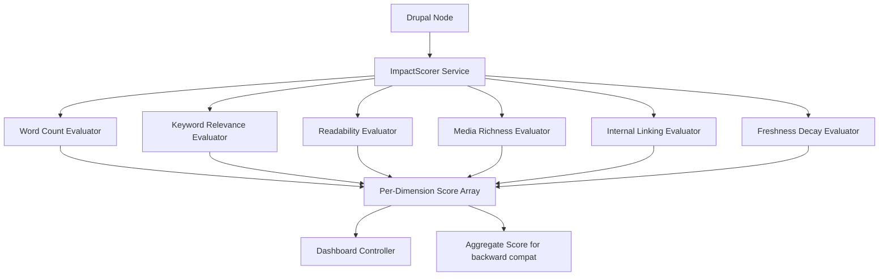

import Tabs from '@theme/Tabs';
import TabItem from '@theme/TabItem';

The first version of Drupal AI Content Impact Analyzer was a minimal proof-of-concept: a single scoring function, no tests, no documentation worth mentioning. It proved the idea worked. It did not prove the idea was **useful** to editors who need to know exactly why a piece of content scores the way it does. The upgrade rewrites the core into a **6-dimension scoring engine** that tells editors precisely what to fix.

<!-- truncate -->

## What Changed

The original `ImpactScorer` returned one opaque number. The new version evaluates every node across six measurable dimensions:

- **Word count** -- raw content length, because thin pages underperform and editors need to see it quantified.
- **Keyword relevance** -- term-frequency scoring against a configurable keyword list.
- **Readability** -- sentence-length analysis that flags walls of text without dragging in external NLP libraries.
- **Media richness** -- counts `img`, `iframe`, `video`, and `audio` elements to reward pages that go beyond plain text.
- **Internal linking** -- measures how well a node connects to the rest of the site's content graph.
- **Freshness decay** -- a 180-day linear decay function. Content older than six months with no updates gets penalized proportionally.



The scoring breakdown is **returned per-dimension**, not collapsed into a single number. Editors see a structured response showing each axis and its individual score. That changes the conversation from "your content scored 42" to "your content scored low on internal linking and freshness -- here is what to improve."

## Tech Stack

| Component | Technology | Why |
|---|---|---|
| CMS | Drupal 10/11 | Target platform, hooks + services architecture |
| Scoring | PHP `ImpactScorer` service | Pure functions, no LLM calls in the critical path |
| Testing | PHPUnit (11 tests) | Every scoring dimension tested in isolation |
| UI | Drupal admin dashboard controller | Editors see results without leaving the CMS |
| License | MIT | Open for adoption |

## Architecture

This is still a Drupal module. Hooks, an action plugin, and a dashboard controller wire it into the admin UI. The `ImpactScorer` service runs the six evaluations and returns a keyed array. The API is **backward-compatible** -- callers that only read the aggregate score keep working, but new consumers can access the full dimension breakdown.

:::tip[Score Each Dimension Independently]
A single composite number is easy to compute but impossible to act on. When each dimension is visible, editors can prioritize: add images, update stale pages, improve internal linking.
:::

:::caution[Freshness Decay Is a 180-Day Linear Function]
Content older than six months with no updates gets penalized proportionally. If your editorial calendar has seasonal content that is intentionally static, you may need to adjust the decay window or exempt certain content types.
:::

<Tabs>
<TabItem value="before" label="Before (v1)" default>

```php title="src/ImpactScorer.php"
// Single opaque score — useless for editors
public function score(NodeInterface $node): int {
return $this->computeAggregate($node);
}
```

</TabItem>
<TabItem value="after" label="After (v2)">

```php title="src/ImpactScorer.php" showLineNumbers
// Per-dimension breakdown — actionable
public function score(NodeInterface $node): array {
return [
'word_count' => $this->evaluateWordCount($node),
'keyword_relevance' => $this->evaluateKeywords($node),
'readability' => $this->evaluateReadability($node),
'media_richness' => $this->evaluateMedia($node),
// highlight-next-line
'internal_linking' => $this->evaluateInternalLinks($node),
'freshness' => $this->evaluateFreshness($node),
'aggregate' => $this->computeAggregate($node),
];
}
```

</TabItem>
</Tabs>

## Test Coverage

The module ships with **11 PHPUnit tests** covering every scoring dimension in isolation. Word count, keyword matching, readability thresholds, media detection, link counting, and freshness decay each have dedicated test cases. No dimension ships untested.

<details>
<summary>Test coverage breakdown</summary>

| Test area | Assertions |
|---|---|
| Word count thresholds | Min/max content length scoring |
| Keyword matching | Term-frequency against configurable list |
| Readability | Sentence-length analysis boundaries |
| Media detection | img, iframe, video, audio element counting |
| Internal linking | Link count scoring |
| Freshness decay | 180-day linear decay calculation |
| Aggregate score | Backward-compatible composite number |

</details>

## Why this matters for Drupal and WordPress

Drupal editorial teams get per-dimension scoring directly in the admin UI, replacing guesswork with specific improvement actions. WordPress teams can apply the same six-dimension scoring model through a custom plugin or by extending existing content audit tools like Yoast or Rank Math with freshness decay and internal linking metrics they currently lack. The architecture pattern -- pure PHP scoring functions with no LLM dependency in the critical path -- keeps the module fast enough for real-time editorial dashboards on both platforms, even on shared hosting.

## Technical Takeaway

Score content on **multiple independent axes** and expose the breakdown. A single composite number is easy to compute but impossible to act on. When each dimension is visible, editors can prioritize: add images, update stale pages, improve internal linking. The scoring logic stays deterministic and testable because each dimension is a pure function of the node's field data -- no LLM calls in the critical path.

## References

- [View Code](https://github.com/victorstack-ai/drupal-ai-content-impact-analyzer)
