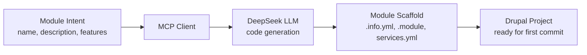

import Tabs from '@theme/Tabs';
import TabItem from '@theme/TabItem';

I built **drupal-ai-module-generator-deepseek-mcp** to take the repetitive, error-prone parts of module setup -- info files, boilerplate, and consistent structure -- and make them fast and repeatable. It fits naturally into agent-driven workflows where you want consistent Drupal modules without losing time to manual setup.

<!-- truncate -->

## The Problem

Every new Drupal module starts the same way: create a folder, write the `.info.yml`, stub out the `.module` file, set up the service container, maybe add routing. It is boring, easy to get wrong, and different every time because nobody remembers the exact schema. When you are iterating on multiple modules or experiments, the setup tax adds up fast.

## The Solution

The generator uses a DeepSeek-backed MCP workflow to scaffold module code. You define the module intent, and the generator enforces a predictable Drupal skeleton that downstream tools can build on.



## Tech Stack

| Component | Technology | Why |
|---|---|---|
| AI backend | DeepSeek | Strong code generation, cost-effective |
| Protocol | MCP (Model Context Protocol) | Standardized tool interface for agent workflows |
| Target | Drupal 10/11 | Module structure follows current coding standards |
| License | MIT | Use it, fork it |

:::tip[Standardize the Starting Point]
The generator pays off almost immediately when iterating on multiple modules. Less time redoing file structures, fewer mistakes in module metadata, and a faster path from idea to a working, testable Drupal feature.
:::

:::caution[Generated Code Needs Review]
The generator creates the skeleton, not the business logic. Always review generated service definitions and routing before committing. LLM output is a starting point, not production code.
:::

<Tabs>
<TabItem value="generated" label="Generated Structure" default>

```text title="generated-module/"
my_module/
  my_module.info.yml
  my_module.module
  my_module.services.yml
  my_module.routing.yml
  src/
Controller/
Service/
```

</TabItem>
<TabItem value="intent" label="Module Intent">

```json title="module-intent.json"
{
  "name": "my_module",
  "description": "Custom content workflow handler",
  "features": ["service", "controller", "routing"],
  "drupal_version": "^10 || ^11"
}
```

</TabItem>
</Tabs>

## Why this matters for Drupal and WordPress

Drupal agencies spinning up multiple custom modules per project spend hours on boilerplate that this generator eliminates in seconds. The same MCP-backed scaffolding pattern transfers directly to WordPress plugin generation -- swapping `.info.yml` for plugin headers, `services.yml` for action/filter registration, and routing files for REST API endpoint stubs. For teams maintaining both Drupal and WordPress projects, standardizing the generator contract through MCP means one workflow pattern serves both ecosystems with platform-specific output templates.

## Technical Takeaway

Pairing MCP with a targeted generator creates a clear contract between intent and output. You define the module intent, and the generator enforces a predictable Drupal skeleton that downstream tools can build on. That makes subsequent automation -- tests, linting, and CI checks -- much easier to wire in.

## References

- [View Code](https://github.com/victorstack-ai/drupal-ai-module-generator-deepseek-mcp)


***
*Need an Enterprise CMS Architect to modernize your legacy PHP platforms? View my case studies at [victorjimenezdev.github.io](https://victorjimenezdev.github.io) or connect with me on LinkedIn.*
