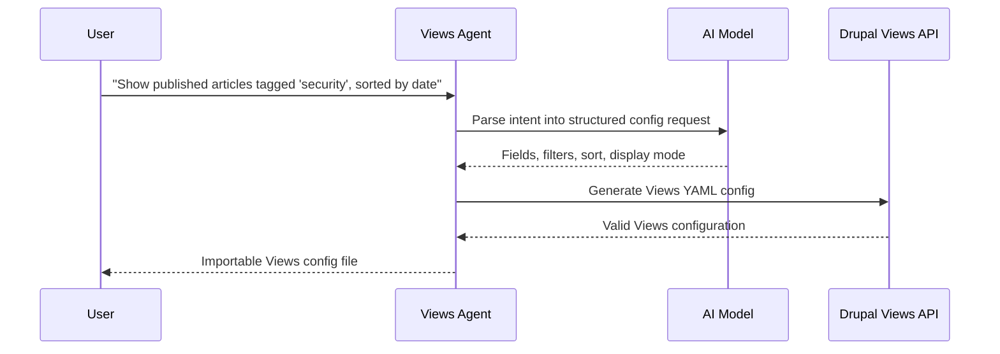

import Tabs from '@theme/Tabs';
import TabItem from '@theme/TabItem';

I built **drupal-ai-views-agent** because Views is powerful but repetitive. Filters, relationships, display modes, and fields add up quickly. Describing what you want in plain language and getting a valid Views config back saves the clicking and lets teams focus on validating data requirements instead of wrestling with UI details.

<!-- truncate -->

## The Problem

Building a Drupal View by hand means clicking through dozens of UI forms: add fields, configure filters, set up relationships, choose display modes. For a complex listing page, that is 20-30 minutes of mechanical work. Multiply that across a site build with 15+ Views and it is a full day of clicking.

The Views UI is good for one-off edits. It is terrible for rapid prototyping.

## The Solution

The agent sits between natural language intent and Drupal's Views configuration API. Describe what you want -- "Show published articles tagged 'security', sorted by date, with author and teaser" -- and the agent assembles the View structure.



## Tech Stack

| Component | Technology | Why |
|---|---|---|
| Target CMS | Drupal 10/11 | Views is a core module with stable config schema |
| AI parsing | LLM intent parsing | Translates natural language to structured config fields |
| Output format | Drupal Views YAML | Directly importable via config sync |
| License | MIT | Open for adoption |

:::tip[Output Structured Config, Not Code]
Agent workflows are most effective when they output structured configuration that maps cleanly onto Drupal's internal APIs. Views config is YAML with a known schema -- the agent does not need to generate PHP.
:::

:::caution[Always Validate Generated Views]
The generated config needs a human review before import. Field machine names, entity reference targets, and relationship chains can drift if the agent's understanding of the site schema is stale.
:::

<Tabs>
<TabItem value="input" label="Natural Language Input" default>

```text title="user-prompt.txt"
Show published articles tagged 'security',
sorted by date descending,
with fields: title, author, teaser, published date.
Page display with 10 items per page.
```

</TabItem>
<TabItem value="output" label="Generated Views Config">

```yaml title="config/views.view.security_articles.yml" showLineNumbers
display:
  default:
display_options:
fields:
title:
type: string
uid:
type: entity_reference_label
body:
type: text_summary_or_trimmed
created:
type: timestamp
filters:
status:
value: '1'
field_tags_target_id:
value: security
sorts:
created:
order: DESC
pager:
type: full
options:
items_per_page: 10
```

</TabItem>
</Tabs>

## Why this matters for Drupal and WordPress

Drupal site builders spend significant time configuring Views through the UI for every listing page, taxonomy display, and content feed. This agent eliminates that mechanical work and outputs importable YAML that fits directly into Drupal's config sync workflow. WordPress teams face the same pattern with WP_Query arguments, custom block registration, and Gutenberg template scaffolding -- the natural-language-to-structured-config approach transfers directly. For agencies building on both platforms, the pattern proves that AI agents are most reliable when they output declarative configuration rather than imperative code.

## Technical Takeaway

Agent workflows are most effective when they output structured configuration that maps cleanly onto Drupal's internal APIs. That makes it easier to validate, version, and refine the generated Views without losing the benefits of automation.

## References

- [View Code](https://github.com/victorstack-ai/drupal-ai-views-agent)


***
*Looking for an Architect who doesn't just write code, but builds the AI systems that multiply your team's output? View my enterprise CMS case studies at [victorjimenezdev.github.io](https://victorjimenezdev.github.io) or connect with me on LinkedIn.*
