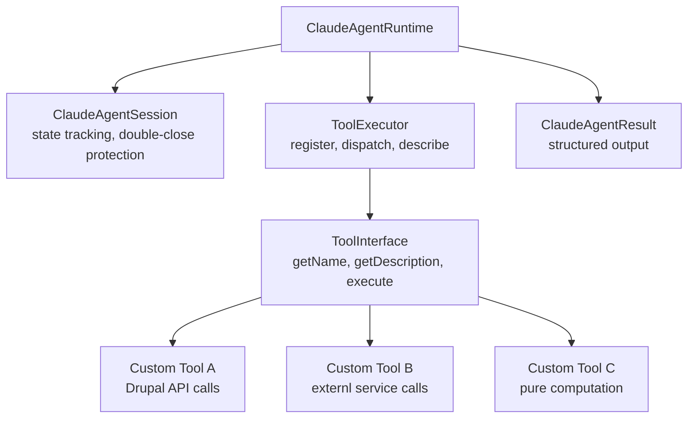

import Tabs from '@theme/Tabs';
import TabItem from '@theme/TabItem';

The first version of `drupal-claude-agent-sdk-runtime` gave you session management and result objects, but tools were mocked. You could simulate agent workflows inside Drupal, but you could not actually execute anything. That ceiling had to go.

<!-- truncate -->

## What Changed

The runtime now ships a **real tool execution framework**. Two new classes define the contract and the dispatcher:

- **`ToolInterface.php`** declares three methods every tool must implement: `getName()`, `getDescription()`, and `execute()`. This is the boundary. If a class satisfies the interface, the runtime can run it.
- **`ToolExecutor.php`** manages the registry. It exposes `register()`, `remove()`, `has()`, `get()`, `execute()`, `listTools()`, and `describeTools()`. You register tool instances, the executor validates and dispatches calls, and you get structured results back.



`ClaudeAgentRuntime` now accepts an **optional `ToolExecutor`** at construction time. If you pass one in, the runtime gains an `executeTool()` method that delegates to the executor. If you don't, the runtime still works for session-only use cases -- no breaking changes. The runtime also has a `closeSession()` method for explicit lifecycle control.

`ClaudeAgentSession` tracks a **closed state** with double-close protection. Calling `closeSession()` twice does not throw -- it short-circuits cleanly. This matters in Drupal's request lifecycle where shutdown hooks can fire more than once.

## Tech Stack

| Component | Technology | Why |
|---|---|---|
| CMS | Drupal 10/11 | Service container, dependency injection |
| Runtime | PHP `ClaudeAgentRuntime` | Optional ToolExecutor, backward-compatible |
| Contract | `ToolInterface` (3 methods) | Small surface, any tool can implement it |
| Dispatch | `ToolExecutor` service | Registry pattern, validates and dispatches |
| Testing | PHPUnit (32 tests, 4 classes) | Every public method, happy + failure paths |
| License | MIT | Open for adoption |

:::tip[Define the Contract First]
`ToolInterface` is three methods. That is it. The executor does not know or care what your tools do internally. Keep the contract small and the registry dumb. The intelligence belongs in the tools, not the framework.
:::

:::caution[Double-Close Protection Matters in Drupal]
Drupal's request lifecycle means shutdown hooks can fire more than once. If your session close handler throws on the second call, you get mysterious errors in production. The runtime short-circuits cleanly on double-close.
:::

<Tabs>
<TabItem value="interface" label="ToolInterface" default>

```php title="src/ToolInterface.php"
interface ToolInterface {
public function getName(): string;
public function getDescription(): string;
// highlight-next-line
public function execute(array $input): array;
}
```

</TabItem>
<TabItem value="executor" label="ToolExecutor">

```php title="src/ToolExecutor.php" showLineNumbers
class ToolExecutor {
public function register(ToolInterface $tool): void;
public function remove(string $name): void;
public function has(string $name): bool;
public function get(string $name): ToolInterface;
// highlight-next-line
public function execute(string $name, array $input): array;
public function listTools(): array;
public function describeTools(): array;
}
```

</TabItem>
<TabItem value="runtime" label="Runtime Integration">

```php title="src/ClaudeAgentRuntime.php" showLineNumbers
// highlight-next-line
$runtime = new ClaudeAgentRuntime($toolExecutor);
$session = $runtime->startSession();

// Execute a registered tool
$result = $runtime->executeTool('my_tool', ['key' => 'value']);

// Session lifecycle
$runtime->closeSession();
// Safe: calling again does not throw
$runtime->closeSession();
```

</TabItem>
</Tabs>

## Test Coverage

**32 PHPUnit tests across 4 test classes**: `RuntimeTest`, `SessionTest`, `ResultTest`, and `ToolExecutorTest`. The test suite validates tool registration, duplicate handling, execution dispatch, session state transitions, and the full runtime integration path. Every public method on every new class has at least one assertion covering the happy path and one covering the failure mode.

<details>
<summary>Test class breakdown</summary>

| Test class | Coverage area |
|---|---|
| `RuntimeTest` | Session lifecycle, tool execution delegation |
| `SessionTest` | State transitions, double-close protection |
| `ResultTest` | Structured output formatting |
| `ToolExecutorTest` | Registration, dispatch, duplicate handling, error paths |

</details>

## Drupal Integration

The module wires the executor as a Drupal service: **`claude_agent_sdk.tool_executor`**. You inject it the same way you inject any other Drupal service -- through the container, via `\Drupal::service()`, or through constructor injection in your own services and controllers. The runtime and executor are decoupled, so you can swap, extend, or decorate the executor without touching the runtime.

## Why this matters for Drupal and WordPress

Drupal's service container and dependency injection make it a natural fit for a registry-based tool executor -- you wire `claude_agent_sdk.tool_executor` like any other service, and custom modules can register tools without modifying the runtime. WordPress developers building similar agent integrations can adapt the ToolInterface pattern as a plugin contract, using WordPress hooks to register and dispatch tools. The double-close session protection is especially relevant for both CMS platforms, where shutdown hooks and request lifecycle callbacks can fire unpredictably.

## Technical Takeaway

**Define the tool contract first, then build the executor around it.** `ToolInterface` is three methods. That's it. The executor doesn't know or care what your tools do internally -- it only knows the interface. This means you can write tools that call Drupal APIs, external services, or pure computation, and the runtime dispatches them identically. Keep the contract small and the registry dumb. The intelligence belongs in the tools, not the framework.

## References

- [View Code](https://github.com/victorstack-ai/drupal-claude-agent-sdk-runtime)


***
*Looking for an Architect who doesn't just write code, but builds the AI systems that multiply your team's output? View my enterprise CMS case studies at [victorjimenezdev.github.io](https://victorjimenezdev.github.io) or connect with me on LinkedIn.*
