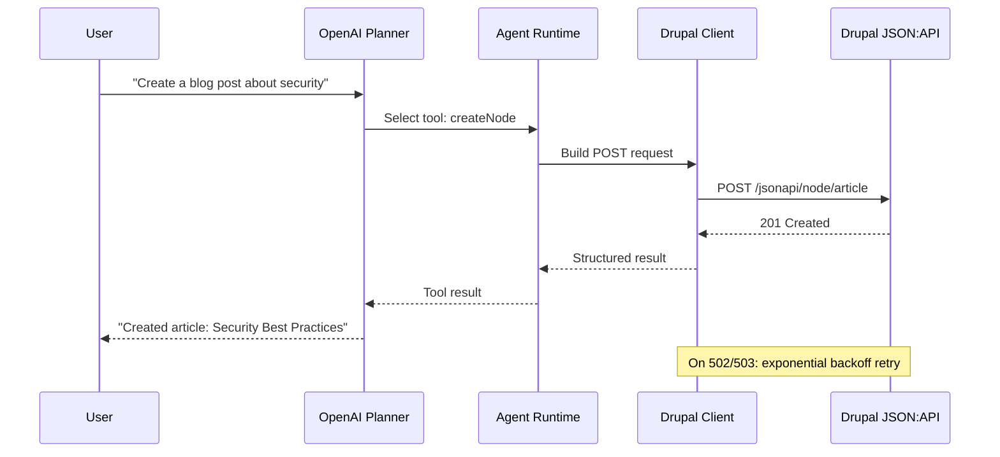

import Tabs from '@theme/Tabs';
import TabItem from '@theme/TabItem';

The original POC had three actions -- create a node, read a node, list nodes. Enough to prove the concept, not enough to be useful. A real content operations agent needs to modify, delete, query users, browse taxonomies, and handle media. It also needs to survive flaky networks without crashing.

<!-- truncate -->

## What Changed

The agent now supports **9 actions** -- the original 3 plus 5 new ones:

- **`updateNode`** sends a PATCH request to update existing content.
- **`deleteNode`** sends a DELETE request to remove content.
- **`listUsers`** queries the Drupal JSON:API users endpoint.
- **`listTaxonomyTerms`** queries taxonomy term collections for vocabulary browsing.
- **`uploadMedia`** handles file uploads through Drupal's media system.

Each action follows the same pattern: validate inputs, build the request, call the Drupal client, return structured results. The OpenAI planner sees all 9 actions as available tools and selects the right one based on the user's intent.



## Tech Stack

| Component | Technology | Why |
|---|---|---|
| Planner | OpenAI GPT | Tool selection from natural language intent |
| Runtime | Node.js | Async HTTP, JSON:API client |
| API | Drupal JSON:API | Standard RESTful interface for all content operations |
| Retry | Exponential backoff | Survives deployment windows and cache rebuilds |
| Testing | Jest (24 tests, 4 files) | Mocked Drupal responses, full pipeline coverage |
| License | MIT | Open for adoption |

## Error Recovery

**Exponential backoff with retry** is now built into the Drupal client. The agent retries automatically on HTTP status codes **408, 429, 500, 502, 503, 504** -- the standard set of transient server errors. Network-level failures like **DNS resolution errors and connection resets** also trigger retries. Each retry doubles the wait time. If all retries exhaust, the agent surfaces a clear error instead of hanging or throwing an unhandled exception.

:::caution[Drupal Behind Reverse Proxies Returns 502/503 During Deployments]
Drupal sites behind reverse proxies and CDNs return 502 and 503 during deployments and cache rebuilds. An agent that gives up on the first transient failure is unusable in production. Retry logic belongs in the HTTP client layer, not scattered across individual actions.
:::

:::tip[Retry at the Transport Layer, Not the Action Layer]
Every action goes through the same Drupal client, so transient error handling is defined once. When you add action number 10 or 15, you get retry behavior for free. Put resilience at the transport layer and keep the business logic naive about network conditions.
:::

<Tabs>
<TabItem value="actions" label="All 9 Actions" default>

```javascript title="src/actions/index.js" showLineNumbers
const actions = {
  // Original 3
  createNode: require('./createNode'),
  readNode: require('./readNode'),
  listNodes: require('./listNodes'),
  // New 5
  // highlight-start
  updateNode: require('./updateNode'),
  deleteNode: require('./deleteNode'),
  listUsers: require('./listUsers'),
  listTaxonomyTerms: require('./listTaxonomyTerms'),
  uploadMedia: require('./uploadMedia'),
  // highlight-end
};
```

</TabItem>
<TabItem value="retry" label="Retry Logic">

```javascript title="src/drupalClient.js" showLineNumbers
async function requestWithRetry(config, retries = 3) {
  for (let attempt = 0; attempt <= retries; attempt++) {
try {
const response = await axios(config);
return response;
} catch (error) {
const status = error.response?.status;
// highlight-next-line
const retryable = [408, 429, 500, 502, 503, 504].includes(status)
|| error.code === 'ECONNRESET'
|| error.code === 'ENOTFOUND';

if (!retryable || attempt === retries) throw error;

const delay = Math.pow(2, attempt) * 1000;
await new Promise(r => setTimeout(r, delay));
}
  }
}
```

</TabItem>
</Tabs>

## Test Coverage

**24 tests across 4 test files**: `drupalClient.test.js`, `actions.test.js`, `agent.test.js`, and `openAiPlanner.test.js`. The tests validate HTTP method selection per action, retry behavior on transient errors, planner tool registration, and end-to-end agent orchestration with mocked Drupal responses. Every new action has dedicated assertions.

<details>
<summary>Test file breakdown</summary>

| Test file | Coverage area |
|---|---|
| `drupalClient.test.js` | Retry logic, transient error handling, HTTP method selection |
| `actions.test.js` | All 9 actions: input validation, request building |
| `agent.test.js` | End-to-end orchestration with mocked Drupal |
| `openAiPlanner.test.js` | Tool registration, intent-to-action mapping |

</details>

## Project Hygiene

The repo now includes a **`.env.example`** documenting every required environment variable, a **MIT LICENSE**, and a **comprehensive README** with an ASCII architecture diagram showing the flow from user prompt through the OpenAI planner to Drupal API actions. The README includes **7 usage examples** covering each action type and common multi-step workflows.

## Technical Takeaway

**Retry logic belongs in the HTTP client, not in the action layer.** Every action goes through the same Drupal client, so transient error handling is defined once. The actions stay clean -- they describe what to do, not how to survive failure. When you add action number 10 or 15, you get retry behavior for free. Put resilience at the transport layer and keep the business logic naive about network conditions.

## References

- [View Code](https://github.com/victorstack-ai/drupal-cms-2-ai-agent-poc)
