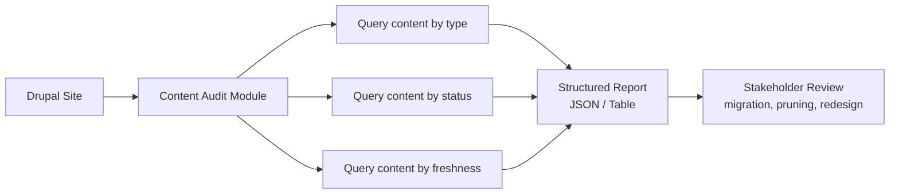

import Tabs from '@theme/Tabs';
import TabItem from '@theme/TabItem';

I built **drupal-content-audit** as a lightweight way to inspect and report on content in a Drupal site. It focuses on surfacing what content exists and how it is distributed, giving a quick snapshot that is easy to share with stakeholders.

<!-- truncate -->

## The Problem

Before a migration, redesign, or content pruning effort, you need answers: How many nodes of each type exist? What is published vs. unpublished? When was the last update? Without a tool, this turns into ad-hoc database queries or manual spreadsheet work that nobody wants to repeat.

## The Solution

The module generates a deterministic content inventory. Point it at a Drupal site and get a structured report of content distribution by type, status, and freshness.



## Tech Stack

| Component | Technology | Why |
|---|---|---|
| CMS | Drupal 10/11 | Target platform |
| Output | Structured JSON / table | Easy to diff over time and wire into CI |
| Scope | Read-only queries | Safe to run on production without side effects |
| License | MIT | Open for adoption |

:::tip[Keep the Audit Output Narrowly Scoped]
When the report structure is stable, it is much easier to diff changes over time and wire it into CI checks or content QA workflows. Resist the urge to add every possible metric -- a focused report gets used; an exhaustive one gets ignored.
:::

:::caution[Run Audits Before Migrations, Not After]
Content audits are most valuable before a migration starts. Once content is mid-flight, the numbers shift and the audit becomes a moving target. Run it, export it, lock it in as the baseline.
:::

<Tabs>
<TabItem value="usage" label="Usage" default>

```bash title="drush-usage.sh"
# Run the content audit
drush content-audit:run --format=json > audit.json

# Quick summary
drush content-audit:summary
```

</TabItem>
<TabItem value="output" label="Sample Output">

```json title="audit-output.json"
{
  "content_types": {
"article": { "published": 142, "unpublished": 23 },
"page": { "published": 38, "unpublished": 5 },
"landing_page": { "published": 12, "unpublished": 2 }
  },
  "total_nodes": 222,
  "last_updated": "2026-02-06T18:07:00Z"
}
```

</TabItem>
</Tabs>

## Why this matters for Drupal and WordPress

Content audits are the first step in any Drupal migration, redesign, or content governance initiative -- agencies running dozens of Drupal sites need a repeatable way to snapshot content distribution before making structural changes. For WordPress-to-Drupal or Drupal-to-WordPress migrations, running this audit on the source site gives you a baseline count by content type and status that directly informs the migration mapping. The JSON output format also integrates cleanly into CI pipelines that both Drupal and WordPress hosting platforms support.

## Technical Takeaway

Keep the audit output narrowly scoped and deterministic. When the report structure is stable, it is much easier to diff changes over time and wire it into CI checks or content QA workflows.

## References

- [View Code](https://github.com/victorstack-ai/drupal-content-audit)


***
*Looking for an Architect who doesn't just write code, but builds the AI systems that multiply your team's output? View my enterprise CMS case studies at [victorjimenezdev.github.io](https://victorjimenezdev.github.io) or connect with me on LinkedIn.*
