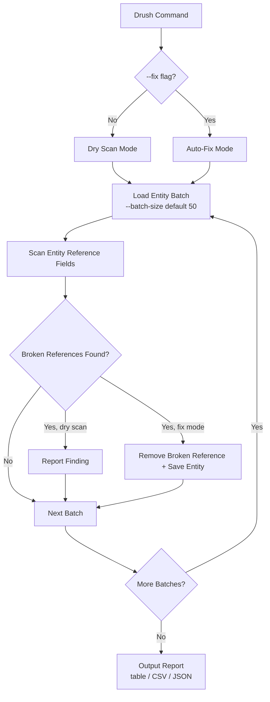

import Tabs from '@theme/Tabs';
import TabItem from '@theme/TabItem';

The first version of drupal-entity-reference-integrity could scan a Drupal site and report broken entity references. That was the easy part. The hard part -- **actually fixing them** at scale without taking the site down -- was missing. This upgrade adds auto-fix mode, batch processing, and the test coverage needed to trust both in production.

<!-- truncate -->

## What Changed

The original module scanned entity reference fields and printed a report. Useful for audits, useless for remediation. You still had to fix every broken reference by hand.

The upgraded module introduces two capabilities that make it production-ready:

- **Auto-fix mode** -- pass the `--fix` flag to the Drush command and the module removes broken references from entity fields and saves the entities automatically. No manual editing. No exporting config and grepping through YAML.
- **Batch processing** -- the `--batch-size` flag (default 50) controls how many entities are loaded and processed per cycle. Large sites with tens of thousands of nodes no longer risk memory exhaustion or timeout. The scanner processes one batch, flushes, and moves to the next.



The Drush command still supports **table, CSV, and JSON output** for reporting. You can run a dry scan first to review what would change, then re-run with `--fix` to apply corrections.

## Tech Stack

| Component | Technology | Why |
|---|---|---|
| CMS | Drupal 10 and 11 | No deprecated API calls, no version-locked service defs |
| CLI | Drush command | `--fix`, `--batch-size`, `--format` flags |
| Testing | PHPUnit (9 tests) | Mocked entity storage, no database required |
| Output | Table, CSV, JSON | Whatever downstream tools need |
| License | MIT | Open for adoption |

:::tip[Dry Scan First, Then Fix]
The `--fix` flag is intentionally opt-in. The default behavior is still a non-destructive scan. Always run a dry scan first, review the report, and then re-run with `--fix`. This is especially important on large sites where you want to verify the scope of changes before applying them.
:::

:::caution[Batch Size Matters on Large Sites]
The default batch size of 50 is conservative. On sites with tens of thousands of nodes, you may want to increase it for speed or decrease it if memory is tight. Watch PHP's `memory_limit` and the Drush timeout settings.
:::

<Tabs>
<TabItem value="scan" label="Dry Scan" default>

```bash title="drush-scan.sh"
# Scan and report — no changes applied
drush entity-reference-integrity:scan --format=table
drush entity-reference-integrity:scan --format=json > report.json
drush entity-reference-integrity:scan --format=csv > report.csv
```

</TabItem>
<TabItem value="fix" label="Auto-Fix">

```bash title="drush-fix.sh"
# Scan and auto-fix broken references
# highlight-next-line
drush entity-reference-integrity:scan --fix --batch-size=100
```

</TabItem>
</Tabs>

## Test Coverage

**9 PHPUnit tests** with comprehensive mocking validate the scanner, the auto-fix logic, the batch processing boundaries, and the output formatting. Entity storage, field definitions, and entity references are all mocked so the tests run without a database. Every code path that touches entity data is covered.

<details>
<summary>Test coverage areas</summary>

| Area | What is tested |
|---|---|
| Scanner | Detecting broken references across field types |
| Auto-fix | Removing broken refs and saving entities |
| Batch processing | Boundary handling, flush between batches |
| Output formatting | Table, CSV, JSON serialization |
| Mocking | Entity storage, field definitions, references |

</details>

## Technical Takeaway

Detection without remediation is a report that sits in someone's inbox. **Auto-fix changes the workflow**: scan, review, apply. Batch processing makes this viable on real sites where entity counts are in the tens of thousands. The `--fix` flag is intentionally opt-in -- the default behavior is still a non-destructive scan -- so the module is safe to add to existing sites without risk of unintended writes.

## References

- [View Code](https://github.com/victorstack-ai/drupal-entity-reference-integrity)
