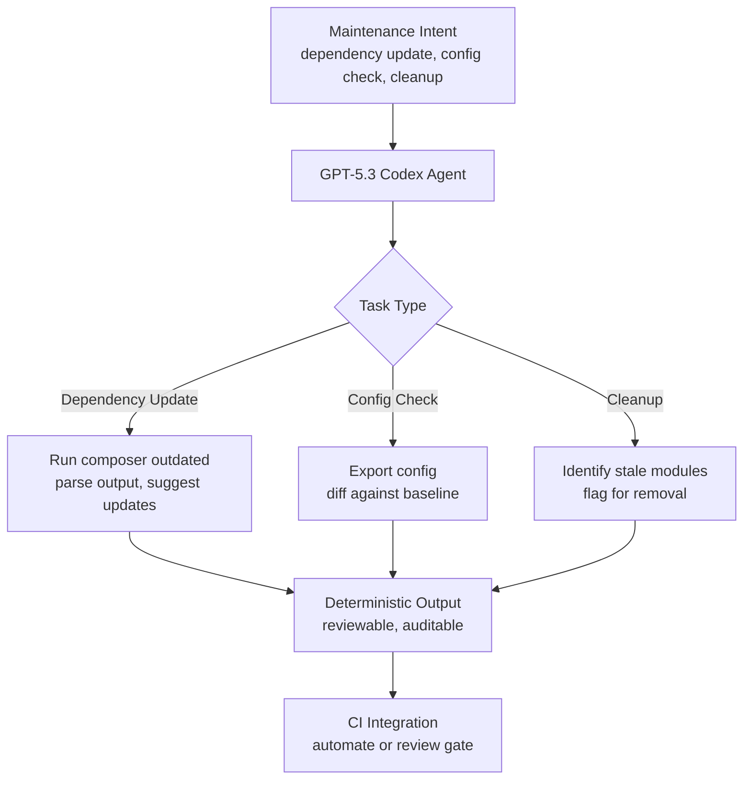

import Tabs from '@theme/Tabs';
import TabItem from '@theme/TabItem';

I built this proof-of-concept to explore how a codex-style agent can assist with routine Drupal maintenance tasks -- dependency updates, configuration checks, and basic cleanup. The kind of work that is constant, easy to overlook, and expensive to do manually at scale.

<!-- truncate -->

## The Problem

Maintenance work in Drupal is death by a thousand paper cuts. Update dependencies, check config drift, audit unused modules, clean up stale content. Each task is small. None is hard. All of them together eat an entire sprint if you let them accumulate.

I wanted to see if a narrow, well-scoped agent could standardize these workflows and make them auditable.

## The Solution

The PoC uses GPT-5.3 Codex to interpret maintenance intent and apply safe, repeatable changes. It is not a platform -- it is a focused experiment validating whether agent-driven maintenance is reliable enough to integrate into CI.



## Tech Stack

| Component | Technology | Why |
|---|---|---|
| Agent | GPT-5.3 Codex | Code-oriented reasoning, good at interpreting CLI output |
| Target | Drupal 10/11 | Composer-based dependency management |
| Workflows | Dependency updates, config checks, cleanup | The maintenance tasks that accumulate fastest |
| License | MIT | Open for adoption |

:::tip[Keep Agent Workflows Deterministic]
Even a narrow, well-scoped agent can create real value by standardizing maintenance logic and making it auditable. If the workflows are deterministic and the outputs are easy to review, teams can integrate this approach into CI without adding unpredictable risk.
:::

:::caution[This Is a PoC, Not Production Automation]
The PoC validates the workflow pattern. It does not handle edge cases like conflicting dependency constraints, custom patches, or multi-site configurations. Treat the output as suggestions for human review, not automated commits.
:::

<Tabs>
  <TabItem value="deps" label="Dependency Check" default>

```bash title="maintenance/dependency-check.sh"
# Agent parses this output and suggests safe updates
composer outdated --direct --format=json
```

  </TabItem>
  <TabItem value="config" label="Config Drift">

```bash title="maintenance/config-drift.sh"
# Export current config and diff against baseline
drush config:export --destination=/tmp/config-export
# highlight-next-line
diff -r /tmp/config-export config/sync/
```

  </TabItem>
</Tabs>

## Technical Takeaway

Even a narrow, well-scoped agent can create real value by standardizing maintenance logic and making it auditable. If the workflows are deterministic and the outputs are easy to review, teams can integrate this approach into CI without adding unpredictable risk.

## References

- [View Code](https://github.com/victorstack-ai/drupal-gpt53-codex-maintenance-poc)
