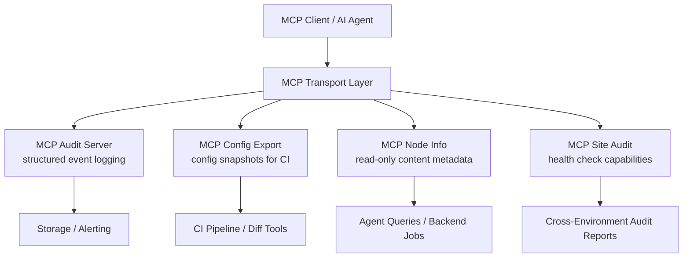

import Tabs from '@theme/Tabs';
import TabItem from '@theme/TabItem';

As AI agents become part of the Drupal workflow, you need infrastructure that makes automation traceable, predictable, and composable. I built four small Drupal modules that together form an **MCP Toolkit** for agent-driven site management.

<!-- truncate -->

## The Problem

When agents modify configuration, create content, or run audits on a Drupal site, you need:

1. **Visibility** into what agents did and when.
2. **Structured access** to content and config without scraping rendered pages.
3. **Audit checks** that agents can invoke programmatically.
4. **Configuration snapshots** for diffing and CI validation.

Each of these is a small, focused concern -- so I built each as a separate module with a narrow, well-defined surface.

## Architecture



## The Toolkit

| Module | Purpose | Key Capability |
|---|---|---|
| MCP Audit Server | Agent activity logging | Structured events, decoupled from Drupal logs |
| MCP Config Export | Configuration snapshots | MCP-friendly format for automation and diffing |
| MCP Node Info | Content metadata access | Read-only node IDs, titles, types, statuses |
| MCP Site Audit | Site health checks | Composable audit capabilities across environments |

### 1. MCP Audit Server

A lightweight server that sits between an MCP client and Drupal, capturing structured events: what tools ran, what endpoints were touched, and when. This gives you a decoupled audit trail that doesn't pollute Drupal's application logs.

:::tip[Treat Audit Trails as a First-Class Integration Boundary]
Emit structured events from the MCP layer, then fan out to storage or alerting without touching Drupal internals. This keeps your audit data clean and queryable independent of Drupal's watchdog.
:::

[View Code](https://github.com/victorstack-ai/drupal-mcp-audit-server)

### 2. MCP Config Export

Exports site configuration in an MCP-friendly format that agents and CI pipelines can consume directly. Instead of hand-checking YAML, you get a focused export target for automation, diffing, and validation.

> Treating configuration as a first-class output makes automation more reliable. When the config surface is explicit and repeatable, you can diff, validate, and react to changes with confidence -- especially valuable in multi-env setups.

[View Code](https://github.com/victorstack-ai/drupal-mcp-config-export)

### 3. MCP Node Info

Exposes node metadata (IDs, titles, types, statuses, timestamps) through an MCP-style interface. Agents and backend jobs can query Drupal content in structured form without pulling full rendered pages.

:::caution[Keep the Read Surface Thin]
A thin, read-only capability surface stays predictable, cache-friendly, and easy to extend later without breaking clients. Resist the urge to expose full entity data through this endpoint.
:::

[View Code](https://github.com/victorstack-ai/drupal-mcp-node-info)

### 4. MCP Site Audit

Packages site health checks behind a predictable MCP endpoint. Configuration, content, and operational issues become reusable, composable audit capabilities that agents can invoke across environments.

[View Code](https://github.com/victorstack-ai/drupal-mcp-site-audit)

<Tabs>
<TabItem value="audit" label="Audit Server" default>

```php title="mcp_audit_server/src/AuditLogger.php"
// Structured event capture
// highlight-next-line
$this->log('tool_executed', [
'tool' => $toolName,
'endpoint' => $endpoint,
'timestamp' => time(),
'result' => $result->toArray(),
]);
```

</TabItem>
<TabItem value="config" label="Config Export">

```bash title="drush-config-export.sh"
# Export config in MCP-friendly format
drush mcp:config-export --format=json > config-snapshot.json
```

</TabItem>
<TabItem value="nodeinfo" label="Node Info">

```json title="mcp-node-info-response.json" showLineNumbers
{
  "nodes": [
{
"nid": 42,
"title": "Security Policy",
"type": "page",
"status": 1,
"changed": "2026-02-06T18:09:00Z"
}
  ]
}
```

</TabItem>
</Tabs>

<details>
<summary>Tech stack for all four modules</summary>

| Component | Technology | Why |
|---|---|---|
| CMS | Drupal 10/11 | Service container, hooks architecture |
| Protocol | MCP | Standardized tool discovery and transport |
| Audit storage | Decoupled from Drupal logs | Clean, queryable event data |
| Config format | JSON export | Machine-readable for CI pipelines |
| Content access | Read-only MCP endpoint | Cache-friendly, predictable surface |

</details>

## Why this matters for Drupal and WordPress

These four modules define a reference architecture for how CMS sites can expose structured data to AI agents through MCP. Drupal agencies can deploy the toolkit across client sites to get standardized audit trails, config snapshots, and health checks without custom scripting per project. WordPress teams can use the same modular pattern -- an MCP audit logger as a plugin, a WP-CLI config exporter, a read-only post metadata endpoint -- to bring equivalent agent-driven management to WordPress sites. The key insight is that each concern (logging, config, content, health) stays in its own module or plugin, so you adopt only what you need.

## What I Learned

- **Small modules win**: Each tool does one thing well. Composing them is easier than maintaining a monolithic "agent platform."
- **MCP as the integration contract**: By standardizing on MCP, all four modules share the same transport and discovery patterns. Adding a fifth tool takes minutes.
- **Separation reduces risk**: Audit logs, config exports, and content queries each live in their own module. A bug in one doesn't break the others.

## References

- [drupal-mcp-audit-server](https://github.com/victorstack-ai/drupal-mcp-audit-server)
- [drupal-mcp-config-export](https://github.com/victorstack-ai/drupal-mcp-config-export)
- [drupal-mcp-node-info](https://github.com/victorstack-ai/drupal-mcp-node-info)
- [drupal-mcp-site-audit](https://github.com/victorstack-ai/drupal-mcp-site-audit)
