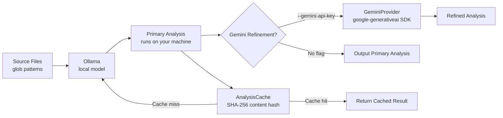

import Tabs from '@theme/Tabs';
import TabItem from '@theme/TabItem';

**Gemini Ollama CLI Bridge** chains a local Ollama model with Google's Gemini into a two-stage code analysis pipeline. The first version piped data to Gemini through a shell subprocess -- fragile, hard to test, and impossible to cache. This upgrade replaces the shell integration with the **google-generativeai Python SDK**, adds **result caching**, and grows the test suite from 4 tests to **22**.

<!-- truncate -->

## What Changed

The biggest architectural change is the **GeminiProvider class**. The old approach spawned a subprocess, piped stdin to the `gemini` CLI binary, and hoped for the best. That broke on path issues, swallowed errors silently, and made unit testing require a live Gemini installation. The new `GeminiProvider` uses the `google-generativeai` Python SDK directly. API key and model selection are explicit CLI flags (`--gemini-api-key`, `--gemini-model`), replacing the opaque `--gemini-command` string. Errors surface as typed exceptions, not exit codes.



The second major addition is **AnalysisCache**. Every analysis result is keyed by a SHA-256 hash of the input content and stored to disk in `.ollama_cache/`. Re-running the same analysis against unchanged files returns instantly without hitting either Ollama or Gemini. The `--no-cache` flag bypasses caching when you need fresh results. On large codebases where incremental changes are the norm, this cuts repeat analysis time to near zero.

## Tech Stack

| Component | Technology | Why |
|---|---|---|
| Local analysis | Ollama | Runs on your machine, no API costs |
| Cloud refinement | Google Gemini (via `google-generativeai` SDK) | Opt-in, SDK replaces fragile subprocess |
| Caching | SHA-256 content-addressed disk cache | Near-zero repeat analysis time |
| Language | Python 3.11+ | Ecosystem fits both SDK and CLI needs |
| Testing | pytest (22 tests) | From 4 to 22, full pipeline coverage |
| License | MIT | Open for adoption |

:::tip[Replace Shell Subprocesses with SDK Calls]
A subprocess gives you flexibility at the cost of testability, error handling, and portability. The `google-generativeai` SDK turns Gemini calls into normal Python function calls -- mockable, type-checked, and predictable. If you are shelling out to an API, stop and check if there is an SDK.
:::

:::caution[Cache Invalidation Is Content-Addressed]
The cache keys on SHA-256 of input content, not file paths or timestamps. This means renaming a file without changing its content returns the cached result. If you change the analysis prompt but not the files, use `--no-cache` to force a fresh run.
:::

## CLI Interface

<Tabs>
<TabItem value="before" label="Before (subprocess)" default>

```bash title="old-cli-usage.sh"
# Old: fragile subprocess piping
python bridge.py analyze src/ --gemini-command "gemini --model pro"
```

</TabItem>
<TabItem value="after" label="After (SDK)">

```bash title="new-cli-usage.sh"
# New: explicit SDK flags
# highlight-next-line
python bridge.py analyze src/ --gemini-api-key $GEMINI_KEY --gemini-model gemini-pro

# Skip cache for fresh results
python bridge.py analyze src/ --no-cache --gemini-api-key $GEMINI_KEY
```

</TabItem>
</Tabs>

The CLI flags reflect the new architecture:

- `--gemini-model` -- select the Gemini model (replaces the old command string).
- `--gemini-api-key` -- pass the API key directly or via environment variable.
- `--no-cache` -- skip the disk cache and force a fresh analysis run.

File-level include/exclude patterns and Ollama configuration remain unchanged. The local-first design is preserved: Ollama runs the primary analysis on your machine, Gemini refinement is opt-in.

## Test Coverage

The test suite grew from **4 tests to 22**. Coverage now spans:

- **File collection** -- glob patterns, exclusions, edge cases with empty directories.
- **Prompt building** -- template rendering with variable file counts and content.
- **Ollama integration** -- HTTP API mocking, timeout handling, error responses.
- **AnalysisCache** -- cache hits, misses, invalidation, `--no-cache` bypass.
- **GeminiProvider** -- SDK call mocking, model selection, API key validation.
- **End-to-end pipeline** -- full Ollama-to-Gemini flow with mocked providers.

<details>
<summary>Full test coverage breakdown</summary>

| Test area | Count | What is tested |
|---|---|---|
| File collection | 4 | Glob patterns, exclusions, empty dirs |
| Prompt building | 3 | Template rendering, variable content |
| Ollama integration | 4 | HTTP mocking, timeouts, errors |
| AnalysisCache | 4 | Hits, misses, invalidation, bypass |
| GeminiProvider | 4 | SDK mocking, model selection, key validation |
| End-to-end | 3 | Full pipeline with mocked providers |

</details>

## Project Hygiene

The repository includes a **241-line README** with an architecture diagram, full CLI reference, troubleshooting section, and installation steps. A `requirements.txt` pins `google-generativeai>=0.8.0` alongside existing dependencies. **MIT LICENSE** is in place.

## Technical Takeaway

**Replace shell subprocesses with SDK calls.** A subprocess gives you flexibility at the cost of testability, error handling, and portability. The `google-generativeai` SDK turns Gemini calls into normal Python function calls -- mockable, type-checked, and predictable. Pair that with content-addressed caching and you get a pipeline that is both faster on repeat runs and actually possible to test without live API credentials.

## Why this matters for Drupal and WordPress

Drupal and WordPress maintainers and agencies often need to run code analysis on contrib modules or plugins — for security review, upgrade readiness, or style/quality checks. A local-first pipeline (Ollama for fast local analysis, optional Gemini for refinement) keeps sensitive code off the cloud and makes repeat runs cheap via caching. Use the same pattern for scanning Drupal PHP or WordPress PHP before pushing to drupal.org or WordPress.org: run the bridge on your codebase, cache results per commit, and only call Gemini when you need higher-quality refinement or when local models are not enough.

## References

- [gemini-ollama-cli-bridge on GitHub](https://github.com/victorstack-ai/gemini-ollama-cli-bridge)
- [google-generativeai Python SDK](https://pypi.org/project/google-generativeai/)


***
*Looking for an Architect who doesn't just write code, but builds the AI systems that multiply your team's output? View my enterprise CMS case studies at [victorjimenezdev.github.io](https://victorjimenezdev.github.io) or connect with me on LinkedIn.*
