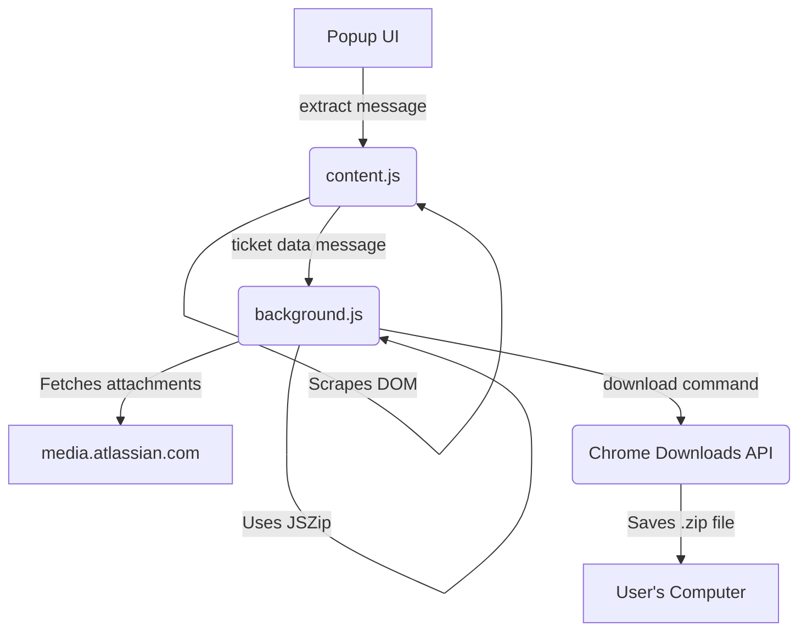

I needed to get data out of Jira. Not just the title, but the full description, comments, and all attachments, packaged neatly for use in other scripts. The official way involves wrestling with an API that feels like it was designed by a committee that never spoke to each other. The unofficial way involves paying $20/month for a SaaS tool that’s just a glorified `curl` command wrapped in a pretty dashboard. I chose the third way: build it myself.

<!-- truncate -->

This is the story of `jiraextractor`, a simple, privacy-first Chrome extension that does one thing and does it well: it rips a Jira ticket's entire contents into a clean, local ZIP file. No servers, no data collection, no nonsense.

## The Problem: Data Hostage Situations

You have a Jira ticket. You need its contents. Your options are, frankly, terrible.

1.  **Manual Labor:** You can copy-paste the description, manually save every image and attachment one-by-one, and try to piece it all together. This is soul-destroying, error-prone, and takes forever. You'll miss a file, a comment, or your will to live.
2.  **The "Official" API:** You can use the Jira REST API. First, you'll need to generate an API token. Then, you'll make a request to the `/rest/api/3/issue/{issueKey}` endpoint. The JSON response you get back is a 5000-line monstrosity containing every field imaginable, except perhaps the one you actually want in a clean format. The description is a blob of proprietary Jira Document Format HTML. Attachments are a list of metadata, requiring *separate authenticated API calls* to download each one. It's a project in itself.
3.  **The SaaS Grift:** Pay a monthly fee for a service that does the above for you. Your private ticket data gets processed on their servers, and you get a webhook or a CSV. It's a tax on not wanting to deal with the API's complexity.

I don't want to authenticate, I don't want to parse a novel of JSON, and I certainly don't want to pay someone else to `fetch` for me. I'm already logged into Jira in my browser. The data is *right there* on the page. Why can't I just take it?

## The Solution: A Browser-Based Heist

The extension works by leveraging the fact that I'm already authenticated in the browser. It uses a content script to scrape the DOM, a background worker to fetch attachments and package everything, and the browser's own download manager to save the result. It's a completely client-side operation.

The architecture is standard for a Manifest V3 extension:



### 1. Triggering the Extraction

The UI is a simple button. When clicked, it sends a message to the content script injected into the active Jira tab.

```javascript
// content.js
chrome.runtime.onMessage.addListener((request, sender, sendResponse) => {
  if (request.action === 'extract') {
    // The magic happens in extractTicket()
    extractTicket().then(result => {
      sendResponse(result);
    }).catch(error => {
      sendResponse({ error: error.message });
    });
    return true; // Keep message channel open for async response
  }
});
```

The `extractTicket()` function (in `extractor.js`) is the core scraper. It hunts through the Jira DOM using a list of potential selectors for the title, description, comments, and attachments. Jira's class names can vary between versions and instances, so you can't rely on a single selector. The scraper tries several known patterns to find the data, making it surprisingly resilient.

### 2. The CORS Dragon and `declarativeNetRequest`

Here's where it gets interesting. The scraped attachment URLs point to resources on domains like `api.media.atlassian.com`. My background script needs to `fetch` these URLs.

A normal `fetch` from a background script to a different domain would trigger a CORS preflight `OPTIONS` request if it includes custom headers, like `Authorization`. Even though my script *doesn't* add this header, Chrome sometimes attaches the session's authentication headers anyway. Atlassian's media servers (likely S3 signed URLs) see this `OPTIONS` request with an `Authorization` header and immediately reject it. They expect a simple `GET`, not a preflight check.

The solution is to intercept the request before it leaves the browser and surgically remove the offending header. In Manifest V2, you'd use the blocking `webRequest` API, but that's a performance killer and deprecated in V3.

The modern, correct way is with `chrome.declarativeNetRequest`. It lets you define rules to modify requests on the fly, handled by the browser itself. It's incredibly fast and doesn't require your service worker to even be running.

I set up a rule on installation to strip the `Authorization` header for any request going to Atlassian's media servers.

```javascript
// background.js

chrome.runtime.onInstalled.addListener(() => {
  chrome.declarativeNetRequest.updateDynamicRules({
    removeRuleIds: [1], // Clear old rule
    addRules: [
      {
        id: 1,
        priority: 1,
        action: {
          type: 'modifyHeaders',
          requestHeaders: [
            { header: 'Authorization', operation: 'remove' }
          ]
        },
        condition: {
          // Match any subdomain of media.atlassian.com
          urlFilter: 'media.atlassian.com', 
          resourceTypes: ['xmlhttprequest', 'other']
        }
      }
    ]
  });
});
```
This rule tells Chrome: "If the service worker tries to fetch anything from a `media.atlassian.com` URL, remove the `Authorization` header before you send it." The preflight request is avoided, the simple `GET` goes through, and the download succeeds.

### 3. Packaging with JSZip

Once the attachments are fetched as blobs, the background script uses the `JSZip` library to create a ZIP archive in memory.

1.  A `ticket.json` file is created with the scraped text content.
2.  Each fetched attachment blob is added to an `attachments/` directory within the virtual ZIP.
3.  `JSZip` generates the final `.zip` file as a blob.
4.  The `chrome.downloads.download()` API is called to save the blob to the user's disk.

The final JSON is clean and predictable:

```json
{
  "title": "Ticket Title",
  "ticketKey": "PROJ-123",
  "url": "https://...",
  "extractedAt": "2024-01-01T00:00:00.000Z",
  "description": "Clean text description without HTML",
  "comments": [
    {
      "id": 1,
      "author": "John Doe",
      "timestamp": "3 days ago",
      "body": "Comment text"
    }
  ],
  "attachments": [
    {
      "id": 1,
      "name": "file.pdf",
      "url": "https://..."
    }
  ]
}
```

## What I Learned

*   **Scraping > API (Sometimes):** For read-only tasks where you're already authenticated, a well-written DOM scraper is often faster to build and more practical than wrestling with a bloated, over-abstraced REST API. The web page is the *real* API.
*   **`declarativeNetRequest` is a Superpower:** This API is the definitive solution for handling complex CORS and header-related issues in Manifest V3. It's faster and safer than the old `webRequest` API. If you're building an extension that interacts with third-party resources, you need to understand it.
*   **Keep it Client-Side:** You don't always need a server. By using `JSZip` and the `Downloads` API, the entire process runs on the user's machine. This is faster, cheaper, and infinitely more secure and privacy-respecting than piping user data through a random backend.
*   **Build Your Own Damn Tools:** The project even includes a small Python script using Pillow to generate the extension icons. Don't waste time in a web-based "icon generator" or installing some massive npm dependency. A few lines of code you own and understand is always better.

```python
# create_icons.py
#!/usr/bin/env python3
from PIL import Image, ImageDraw

def create_icon(size, output_path):
    # Create a new image with transparent background
    img = Image.new('RGBA', (size, size), (0, 0, 0, 0))
    draw = ImageDraw.Draw(img)
    
    # Draw background circle (Jira blue: #0052CC)
    margin = size // 10
    draw.ellipse([margin, margin, size - margin, size - margin], 
                 fill=(0, 82, 204, 255), outline=None)
    # ... more drawing logic
    img.save(output_path, 'PNG')
```

This whole project is a testament to solving your own problems. Instead of accepting the bad options presented, a few hours of scripting resulted in a tool that perfectly fits the need, with no compromises on privacy or cost.

## References

-   **[View Code on GitHub](https://github.com/victorjimenezdev/jiraextractor)**
-   **[Install from Chrome Web Store](https://chromewebstore.google.com/detail/mjdgnpmadepahnoeiahafimajgoajgdp)**

<script type="application/ld+json">
  {`
{
  "@context": "https://schema.org",
  "@type": "Article",
  "headline": "I Built a Chrome Extension to Rip My Data Out of Jira's Cold, Clammy Hands",
  "description": "A technical deep-dive into building a privacy-first Chrome extension that extracts Jira tickets and all attachments into clean, local JSON, bypassing the need for yet another paid API wrapper.",
  "author": {
    "@type": "Person",
    "name": "Victor Jimenez",
    "url": "https://victorjimenezdev.github.io/"
  },
  "publisher": {
    "@type": "Organization",
    "name": "VictorStack AI",
    "url": "https://victorjimenezdev.github.io/"
  },
  "datePublished": "2026-02-22T05:21:00"
}
  `}
</script>
