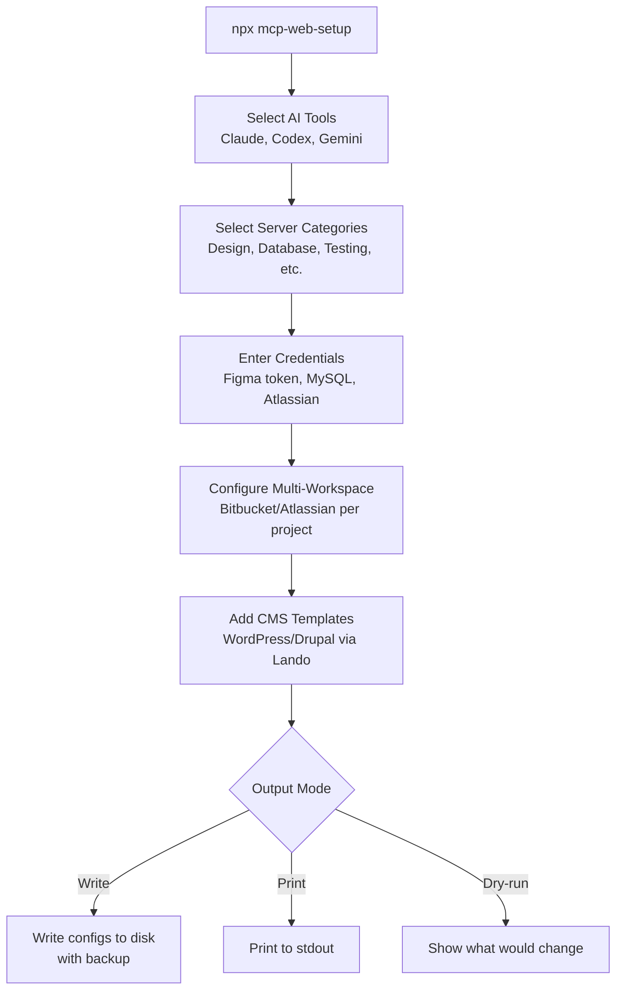

import Tabs from '@theme/Tabs';
import TabItem from '@theme/TabItem';

Every AI coding tool has its own config format for MCP servers. Claude uses JSON, Codex uses TOML, Gemini uses a different JSON schema. Setting up the same 18 servers across all three means editing three files, remembering three formats, and hoping you didn't typo a credential. I built **mcp-web-setup** to do it once.

<!-- truncate -->

## The Problem

MCP servers are powerful -- Playwright for browser testing, Lighthouse for performance, Figma for design tokens, MySQL for database access. But configuring them is tedious:

1. Each AI tool stores MCP config in a different file and format.
2. Credentials (Figma tokens, MySQL passwords, Atlassian keys) need to go in the right places.
3. Multi-workspace setups (different Bitbucket orgs per project) require per-directory configs.
4. CMS projects on Lando need pre-filled database credentials.

Nobody wants to hand-edit TOML for the third time today.

## The Solution

```bash title="one-command-setup.sh"
# highlight-next-line
npx mcp-web-setup
```

An interactive CLI that walks you through selecting tools, server categories, and credentials -- then writes correct configs for all selected platforms.



### Included Servers (18 total)

| Category | Servers |
|----------|---------|
| Design | figma-desktop, figma-developer |
| Database | mysql |
| Browser / Testing | playwright, chrome-devtools, browser-tools |
| Performance / SEO | lighthouse, pagespeed |
| Accessibility | a11y |
| CSS / Styling | css, tailwindcss |
| Linting | eslint |
| Images | image-optimizer |
| Components | storybook |
| Utilities | sequential-thinking |
| Project Tools | atlassian, bitbucket, gtm |

### Config File Targets

| Tool | Global Config | Project Config |
|------|--------------|----------------|
| Claude Code | `~/.claude.json` | `.mcp.json` |
| Codex CLI | `~/.codex/config.toml` | `.codex/config.toml` |
| Gemini CLI | `~/.gemini/settings.json` | `.gemini/settings.json` |

## Tech Stack

| Component | Technology | Why |
|---|---|---|
| Runtime | Node.js | npx distribution, no install step |
| Config formats | JSON + TOML | Covers all three AI tool formats |
| Interactive prompts | inquirer | Clean multi-select and input UX |
| Merge strategy | Safe merge with backup | Never overwrites existing non-MCP settings |
| License | MIT | Open for adoption |

:::tip[Safe Merge with Backup Is Non-Negotiable]
Existing config files are backed up before writing. Only the MCP servers section is merged -- all other settings are preserved. Overwriting someone's existing config is a trust-destroying experience. Always back up first.
:::

:::caution[CMS Templates Save Hours of Debugging]
CMS templates (Lando defaults for WordPress/Drupal MySQL) eliminate a whole class of "why can't it connect" debugging sessions. If your project uses Lando, enable the CMS template step -- it pre-fills host, port, user, and database name.
:::

<Tabs>
<TabItem value="claude" label="Claude Code Output" default>

```json title="~/.claude.json" showLineNumbers
{
  "mcpServers": {
"playwright": {
"command": "npx",
"args": ["@anthropic/mcp-playwright"]
},
"lighthouse": {
"command": "npx",
"args": ["@anthropic/mcp-lighthouse"]
}
  }
}
```

</TabItem>
<TabItem value="codex" label="Codex CLI Output">

```toml title="~/.codex/config.toml"
[mcp_servers.playwright]
command = "npx"
args = ["@anthropic/mcp-playwright"]

[mcp_servers.lighthouse]
command = "npx"
args = ["@anthropic/mcp-lighthouse"]
```

</TabItem>
<TabItem value="gemini" label="Gemini CLI Output">

```json title="~/.gemini/settings.json"
{
  "mcpServers": {
"playwright": {
"command": "npx",
"args": ["@anthropic/mcp-playwright"]
}
  }
}
```

</TabItem>
</Tabs>

### Interactive Flow

1. Select AI tools (Claude Code, Codex CLI, Gemini CLI)
2. Select server categories
3. Enter credentials (Figma token, MySQL password, etc.)
4. Configure multi-workspace Bitbucket/Atlassian accounts
5. Add CMS templates (WordPress/Drupal via Lando)
6. Choose output mode (write to disk, print, or dry-run)

<details>
<summary>All 18 servers with category breakdown</summary>

| # | Server | Category |
|---|---|---|
| 1 | figma-desktop | Design |
| 2 | figma-developer | Design |
| 3 | mysql | Database |
| 4 | playwright | Browser / Testing |
| 5 | chrome-devtools | Browser / Testing |
| 6 | browser-tools | Browser / Testing |
| 7 | lighthouse | Performance / SEO |
| 8 | pagespeed | Performance / SEO |
| 9 | a11y | Accessibility |
| 10 | css | CSS / Styling |
| 11 | tailwindcss | CSS / Styling |
| 12 | eslint | Linting |
| 13 | image-optimizer | Images |
| 14 | storybook | Components |
| 15 | sequential-thinking | Utilities |
| 16 | atlassian | Project Tools |
| 17 | bitbucket | Project Tools |
| 18 | gtm | Project Tools |

</details>

## What I Learned

- Config format fragmentation across AI tools is a real friction point. Abstracting it away saves more time than it should.
- Multi-workspace support (different Atlassian/Bitbucket orgs per directory) is a common need that most setup tools ignore.
- Safe merge with backup is non-negotiable -- overwriting someone's existing config is a trust-destroying experience.
- CMS templates (Lando defaults for WordPress/Drupal MySQL) eliminate a whole class of "why can't it connect" debugging sessions.

## References

- [View Code](https://github.com/victorstack-ai/mcp-web-setup)
