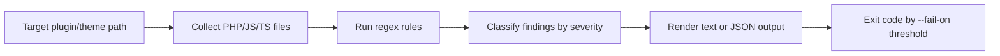

I built `wp-7-compat-scanner` to answer a specific question: how can maintainers quickly detect deprecated hook usage and PHP patterns that can hard-fail in WordPress 7.0-era environments. The tool scans plugin/theme code and returns actionable migration guidance with CI-friendly exit codes.
<!-- truncate -->

## The Problem

WordPress `6.9.1` is the current stable release (February 3, 2026), while `7.0` is still tentative in 2026. Teams still need to reduce upgrade risk now, especially when:

| Risk | Real impact |
|---|---|
| Deprecated hooks stay in code | Behavior drift and fragile integrations during core upgrades |
| Removed PHP APIs (`create_function`, `each`, `mysql_*`) | Fatal errors on modern runtimes |
| No CI scanner focused on this exact mix | Regressions only found in staging or production |

Maintained tools exist, but I did not find a maintained WordPress.org tool focused on this exact pair: deprecated hook detection plus WP 7.0-forward fatal-risk scanning in a lightweight CLI.

## The Solution

The scanner uses rule-based static analysis over plugin/theme source files and reports severity, file, line, and migration replacement text.



Core implementation from `scanner.py`:

```python
Rule(
    rule_id="WP-DEP-001",
    category="deprecated-hook",
    severity="medium",
    pattern=r"""add_filter\(\s*['"]allowed_block_types['"]""",
    message="Legacy allowed_block_types filter detected.",
    replacement="Use allowed_block_types_all with editor context support.",
)
```

```python
Rule(
    rule_id="WP-FATAL-001",
    category="fatal-risk",
    severity="high",
    pattern=r"""\bcreate_function\s*\(""",
    message="create_function() was removed in PHP 8 and will fatal.",
    replacement="Replace with anonymous functions or named callbacks.",
)
```

Rule mapping shipped in this version:

| Rule ID | Category | Severity | Detects | Replace with |
|---|---|---|---|---|
| `WP-DEP-001` | deprecated-hook | medium | `allowed_block_types` | `allowed_block_types_all` |
| `WP-DEP-002` | deprecated-hook | medium | `block_editor_settings` | `block_editor_settings_all` |
| `WP-FATAL-001` | fatal-risk | high | `create_function()` | closures/named callbacks |
| `WP-FATAL-002` | fatal-risk | high | `mysql_*` calls | `$wpdb` / prepared queries |
| `WP-FATAL-003` | fatal-risk | high | `each()` | `foreach` |
| `WP-FATAL-004` | fatal-risk | high | `call_user_method*()` | `call_user_func()` / direct method call |

Test coverage validates both categories and CI behavior in `tests/test_scanner.py`:

```python
categories = {item["category"] for item in data["findings"]}
self.assertIn("deprecated-hook", categories)
self.assertIn("fatal-risk", categories)
```

Related posts: [WordPress 7.0 Release Readiness](/build-wp-7-release-readiness/), [WordPress Dataform Settings Page Demo](/build-wp-dataform-settings-page-demo/), [WordPress Google Preferred Source Tool](/wp-google-preferred-source-tool/).

## What I Learned

- Deprecated-hook scanning is most useful when each finding includes an exact replacement API.
- Fatal-risk checks should focus on patterns known to crash on modern PHP, not style-level warnings.
- A small `--fail-on` threshold model (`high`, `medium`, `low`) makes the tool practical in CI pipelines.

## References

- [View Code](https://github.com/victorstack-ai/wp-7-compat-scanner)
- https://wordpress.org/news/2026/02/wordpress-6-9-1-maintenance-release/
- https://wordpress.org/support/wordpress-version/version-6-9-1/
- https://wordpress.org/documentation/wordpress-version/version-7-0/
- https://wordpress.org/plugins/plugin-check/
- https://wordpress.org/plugins/php-compatibility-checker/
