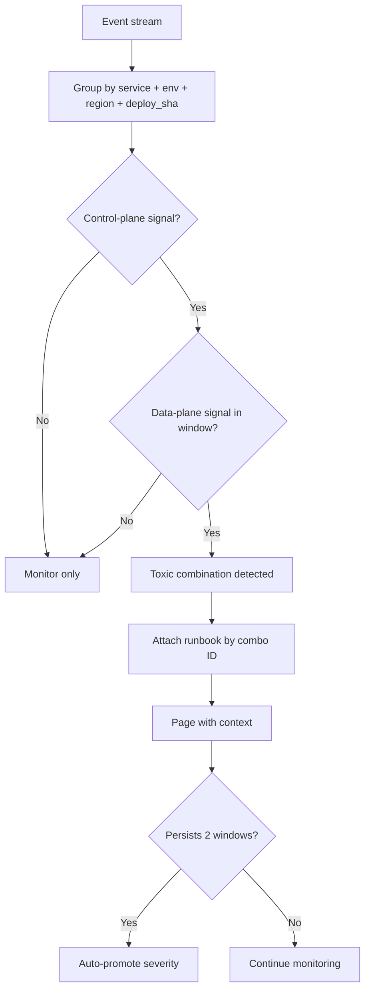

import Tabs from '@theme/Tabs';
import TabItem from '@theme/TabItem';

Cloudflare's "toxic combinations" pattern is operationally useful because it explains why single alerts are often too weak and single thresholds fire too late. For agentic workflows and CI pipelines, this should become a concrete correlation playbook, not just a postmortem lesson.

I distilled the pattern into enforceable rules and escalation thresholds.

<!-- truncate -->

## The Core Insight

> "Incidents often come from individually normal events that become dangerous only when correlated in a short time window."
>
> — Cloudflare, [The Curious Case of Toxic Combinations](https://blog.cloudflare.com/the-curious-case-of-toxic-combinations/)

:::info[Context]
Single-metric alerting fails because each signal in a toxic combination is individually normal. The danger is in the overlap. Most monitoring systems evaluate signals independently. This playbook forces correlation evaluation across signal pairs within defined time windows.
:::

## Alert-Correlation Playbook

<Tabs>
  <TabItem value="combos" label="Low-Signal Combinations">

| Combo ID | Low-signal A | Low-signal B | Window | Escalate When | Severity |
|---|---|---|---|---|---|
| TC-01 | 2 deployments to same service in 30 min | p95 latency up 15% for >=10 min | 30 min | Error budget burn >2%/hour | SEV-3 |
| TC-02 | WAF/rate-limit rule changed | Authenticated 403 rate up 1.5x | 15 min | >=5% signed-in users affected | SEV-2 |
| TC-03 | Feature flag moved above 10% traffic | DB lock wait p95 >300ms | 20 min | Login/checkout routes in impacted set | SEV-2 |
| TC-04 | Secrets rotation finished | Token validation failures >0.7% | 20 min | Sustained for 10 min | SEV-2 |
| TC-05 | Autoscaler event >=20% size change | Upstream 5xx >0.5% | 15 min | Queue lag also rises >25% | SEV-2 |
| TC-06 | Cache purge or key-schema update | Origin egress up 40% | 20 min | CDN hit ratio drops >=10 points | SEV-3 |
| TC-07 | DNS/proxy config change | Regional timeout >1.2% | 30 min | Auth/payment paths impacted | SEV-1 |

  </TabItem>
  <TabItem value="escalation" label="Escalation Thresholds">

| Trigger State | Escalation | Required Actions |
|---|---|---|
| 1 toxic combo, non-critical path | SEV-3 | Assign incident lead, freeze non-critical deploys |
| 1 combo on critical path or 2 combos in one service | SEV-2 | Incident bridge, canary-only mode, service + platform owner paging |
| 2+ combos across multiple services or regions | SEV-1 | Org deploy freeze, rollback/kill-switch in &lt;=10 min |
| Sustained burn >10%/hour or data-risk indicators | SEV-1 Critical | Executive comms path, status page, forensic owner assigned |

  </TabItem>
</Tabs>

## Correlation Rules to Implement First

1. Group events by `service + env + region + deploy_sha` in rolling windows.
2. Require one control-plane signal (deploy/config/policy) plus one data-plane signal (latency/errors/timeouts).
3. Suppress duplicate pages for 15 minutes after acknowledgment while keeping timeline counts.
4. Auto-attach combo runbook links (`TC-01` to `TC-07`) to each page.
5. Auto-promote severity if the condition persists for two consecutive windows.

## CI and Agent Enforcement

| Step | Action |
|---|---|
| 1 | Add `compound_risk_score` from combo count, route criticality, and persistence |
| 2 | Block promotion when score >=70 and rollback certainty is missing |
| 3 | Require two-key approval (service owner + platform owner) for control-plane and auth/routing overlaps |
| 4 | Emit `toxic_combination_candidate` events into telemetry for weekly review |

| Enforcement Level | When |
|---|---|
| Advisory only | Single low-severity combo, non-critical path |
| Soft block (warning + justification required) | Two combos or critical path involved |
| Hard block (human approval required) | Score >=70 or rollback not verified |

:::caution[Reality Check]
Do not promote changes that increase toxic-combination exposure without compensating controls. The whole point of this playbook is to make compound risk visible and actionable before it becomes an incident. If you implement the correlation rules but do not enforce them in CI, you have created a dashboard, not a control.
:::

Implementation priority order

1. **Start with TC-04 (secrets rotation + auth failures)** — Most immediate blast radius for agent workflows
2. **Add TC-01 (rapid deploys + latency)** — Most common CI/CD pattern
3. **Add TC-07 (DNS/proxy + timeouts)** — Highest severity when triggered
4. **Add TC-02 (WAF changes + 403 spikes)** — Common for security team changes
5. **Add remaining combos** as operational maturity grows

Start with deterministic rules. ML anomaly scoring can come later.

## What I Learned

- Cloudflare's "toxic combinations" pattern is the most practical incident prevention framework I have seen for operations.
- Single-signal alerting misses real incidents. Compound detection is the fix.
- Start with deterministic correlation rules. They are easier to debug and explain than ML scoring.
- Do not promote changes that increase toxic-combination exposure without compensating controls.

## References

- [Cloudflare: The Curious Case of Toxic Combinations](https://blog.cloudflare.com/the-curious-case-of-toxic-combinations/)
