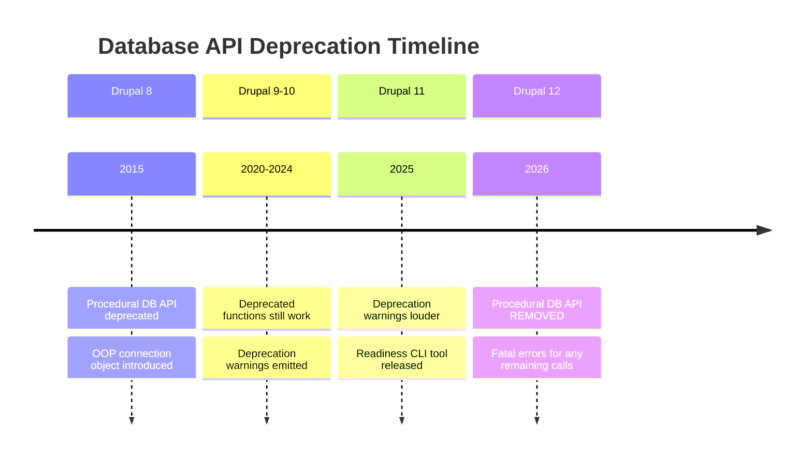

import Tabs from '@theme/Tabs';
import TabItem from '@theme/TabItem';

Drupal 12 is on the horizon, and with it comes the final removal of a long-standing legacy layer: the procedural Database API wrappers. If your codebase still relies on `db_query()`, `db_select()`, or `db_insert()`, you are looking at a hard break when D12 lands. These functions have been deprecated since Drupal 8, but they have stuck around for backward compatibility. That grace period is ending.

<!-- truncate -->

## The issue: [D12] Remove deprecated paths

> The Drupal Core issue **[#3525077: [D12] Remove deprecated paths from the Database API & friends](https://www.drupal.org/project/drupal/issues/3525077)** outlines the plan to strip these wrappers from `core/includes/database.inc`.

:::danger[Hard Break in D12]
Code like `db_query()` will fatal error in Drupal 12. No deprecation warning, no graceful fallback. Fatal error.
:::

### Before and after

<Tabs>
<TabItem value="legacy" label="Legacy (Removed in D12)" default>

```php title="my_module.module"
// highlight-next-line
// This will FATAL ERROR in Drupal 12
$result = db_query("SELECT nid FROM {node} LIMIT 1");
```

</TabItem>
<TabItem value="modern" label="Modern (D12 Ready)">

```php title="my_module.module" showLineNumbers
// highlight-next-line
// Use the injected database service or static container wrapper
$result = \Drupal::database()->query("SELECT nid FROM {node} LIMIT 1");
```

</TabItem>
</Tabs>

The diff:

```diff
- $result = db_query("SELECT nid FROM {node} LIMIT 1");
+ $result = \Drupal::database()->query("SELECT nid FROM {node} LIMIT 1");
```

## Automating the audit

Manually searching for `db_` functions can be noisy because `db_` is a common prefix. I added a new command to my **Drupal 12 Readiness CLI** to specifically target these deprecated API calls.

```bash title="Terminal" showLineNumbers
# Install the tool
composer require --dev victorstack-ai/drupal-12-readiness-cli

# Run the DB API check
# highlight-next-line
./vendor/bin/drupal-12-readiness check:db-api web/modules/custom/my_module
```

The tool scans PHP, module, install, and theme files for 30+ deprecated procedural functions.

### Deprecated function coverage

| Function | Replacement | Deprecated since |
|---|---|---|
| `db_query()` | `\Drupal::database()->query()` | D8 |
| `db_select()` | `\Drupal::database()->select()` | D8 |
| `db_insert()` | `\Drupal::database()->insert()` | D8 |
| `db_update()` | `\Drupal::database()->update()` | D8 |
| `db_delete()` | `\Drupal::database()->delete()` | D8 |
| `db_merge()` | `\Drupal::database()->merge()` | D8 |
| `db_truncate()` | `\Drupal::database()->truncate()` | D8 |
| `db_transaction()` | `\Drupal::database()->startTransaction()` | D8 |
| `db_like()` | `$connection->escapeLike()` | D8 |
| `db_or()` / `db_and()` | `$connection->condition()` | D8 |
| `db_driver()` | `$connection->driver()` | D8 |

### Example output

<details>
<summary>Scanner output for a legacy module</summary>

```text title="Terminal output"
Scanning modules/custom/legacy_module for deprecated Database API usage...

[WARNING] Found 2 instances of deprecated Database API usage:

Location                 Function    Suggested Replacement
----------------------- ----------- ------------------------------------------------
legacy_module.module:10  db_query    Use \Drupal::database()->query()
legacy_module.module:13  db_select   Use \Drupal::database()->select()
```

</details>

### Deprecation timeline



## Why not just use Rector?

Drupal Rector is fantastic and should be your first choice for *fixing* these issues. However, sometimes you just need a lightweight *audit* -- a quick check in CI or a pre-commit hook to say "stop adding new legacy code" without running a full Rector process.

:::tip[Use Both]
Use Rector for the fix. Use this CLI for the audit gate. They complement each other.
:::

## Migration checklist

- [ ] Install the CLI: `composer require --dev victorstack-ai/drupal-12-readiness-cli`
- [ ] Run `check:db-api` on all custom modules
- [ ] Run `check:db-api` on all custom themes
- [ ] Add `check:db-api` to CI as a pre-merge gate
- [ ] Fix findings with Rector or manual refactor
- [ ] Re-run audit to confirm zero findings
- [x] Monitor for new legacy code additions via CI gate

## Why this matters for Drupal and WordPress

Every Drupal agency with custom modules needs to audit for `db_query()` and friends before Drupal 12 lands -- this tool turns that into a CI gate instead of a manual search. Contributed modules on Drupal.org that still use procedural database calls will break, so maintainers should run this audit now. WordPress developers may not face the same deprecation, but the pattern of building lightweight CLI audit tools to catch deprecated function usage applies directly -- WordPress has its own deprecated functions (`query_posts()`, `$wpdb->escape()`) that a similar scanner could flag before they cause production issues.

**[View Code](https://github.com/victorstack-ai/drupal-12-readiness-cli)**


***
*Need an Enterprise CMS Architect to modernize your legacy PHP platforms? View my case studies at [victorjimenezdev.github.io](https://victorjimenezdev.github.io) or connect with me on LinkedIn.*
