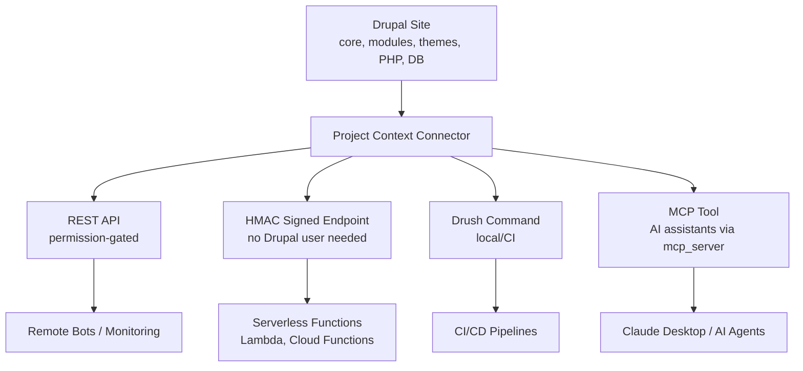

import Tabs from '@theme/Tabs';
import TabItem from '@theme/TabItem';

I built **Project Context Connector**, a Drupal module that makes site configuration programmatically accessible to AI agents, automation scripts, and monitoring tools through multiple interfaces including native Model Context Protocol support.

<!-- truncate -->

## The Problem: Opaque Drupal Sites

When building AI assistants or DevOps automation for Drupal sites, there is no standard way to ask "What version of Drupal is running?" or "Which modules need security updates?" Traditional approaches require SSH access, manual Drush commands, or parsing HTML pages.

For agencies managing dozens of client sites, this creates friction:
- Support bots can't answer environment questions
- CI/CD pipelines can't adapt to site configuration
- AI assistants lack real-time context about the stack
- Security monitoring requires custom scripting for each site

## The Solution: Multiple Access Patterns

Project Context Connector exposes a **read-only JSON snapshot** of Drupal site metadata through four interfaces:



## Tech Stack

| Component | Technology | Why |
|---|---|---|
| CMS | Drupal 10/11 | Target platform, service container |
| Protocol | MCP via `drupal/mcp_server` | Native AI assistant integration |
| Auth (REST) | Drupal permissions | Standard access control |
| Auth (serverless) | HMAC-SHA256 with replay protection | No Drupal user session needed |
| CLI | Drush command | CI/CD pipeline integration |
| Caching | Drupal render cache + cache tags | No extra DB queries on cached hits |
| Testing | Unit, kernel, functional + GitLab CI | Full coverage, production-ready |

### Four Access Patterns

<Tabs>
<TabItem value="rest" label="REST API" default>

```bash title="rest-api-usage.sh"
# Permission-gated REST endpoint
curl -u user:pass https://site.com/project-context-connector/snapshot
```

</TabItem>
<TabItem value="hmac" label="HMAC Signed">

```bash title="hmac-signed-usage.sh"
# No Drupal user needed — HMAC authentication
curl -H "X-PCC-Timestamp: $(date +%s)" \
-H "X-PCC-Signature: $(echo -n "$(date +%s)" | \
openssl dgst -sha256 -hmac 'secret' -binary | base64)" \
https://site.com/project-context-connector/snapshot/signed
```

</TabItem>
<TabItem value="drush" label="Drush">

```bash title="drush-usage.sh"
# Local or CI usage
drush pcc:snapshot --format=json
```

</TabItem>
<TabItem value="mcp" label="MCP Tool">

```json title="mcp-tool-definition.json"
{
  "name": "project_context_snapshot",
  "description": "Get Drupal site context",
  "input": {}
}
```

</TabItem>
</Tabs>

### What Gets Exposed

The snapshot includes exactly what external tools need:

```json title="snapshot-response.json" showLineNumbers
{
  "generated_at": "2026-02-16T18:00:00Z",
  "drupal": {
    "core_version": "10.3.0",
    "php": {"version": "8.3.0"},
    "database": {"driver": "mysql", "version": "8.0.36"},
    "active_modules": [
      {
        "name": "views",
        "version": "10.3.0",
        "origin": "core",
        // highlight-next-line
        "security_status": "current"
      }
    ],
    "themes": {
      "default": "olivero",
      "admin": "claro"
    }
  }
}
```

Security update status comes from Drupal's Update module cache (no outbound requests).

## MCP Integration: Native AI Access

The newest feature is **Model Context Protocol (MCP) support** via Drupal's Tool API. When you install the `mcp_server` module alongside Project Context Connector, AI assistants like Claude Desktop can query your site directly.

:::tip[MCP Means No HTTP Requests Needed]
When Claude Desktop connects via Drush MCP, the tool call runs inside Drupal's process. No HTTP overhead, no authentication dance, no CORS. It is the fastest path from "what PHP version is production running?" to an actual answer.
:::

**Installation:**

```bash title="installation.sh"
composer require drupal/mcp_server drupal/project_context_connector
drush en -y mcp_server project_context_connector
drush cr
```

**Claude Desktop Config:**

```json title="claude-desktop-config.json" showLineNumbers
{
  "mcpServers": {
    "drupal-prod": {
      "command": "drush",
      "args": ["mcp:server"],
      // highlight-next-line
      "cwd": "/var/www/drupal"
    }
  }
}
```

Now Claude can answer questions like "What PHP version is the production site running?" by calling the `project_context_snapshot` tool directly, no HTTP requests needed.

## Real-World Use Case: Slack Bot Integration

I built a companion Slack bot that uses these endpoints to answer team questions:

```text title="slack-bot-interaction.txt"
/drupal-env production

Response:
Production Environment:
- Drupal: 10.3.0
- PHP: 8.3.0
- Database: MySQL 8.0.36
- Modules needing updates: 0
- Security status: All current
```

The bot authenticates via HMAC signatures, runs on AWS Lambda, and costs pennies per month. No SSH access required, no credentials stored in the bot code.

## Security First

The module follows secure-by-default principles:

:::caution[The Snapshot Is Deliberately Minimal]
The snapshot includes versions, security status, and configuration flags, but excludes sensitive data (database credentials, API keys, user information). Even the optional database version is off by default per OWASP recommendation. Do not extend the snapshot with PII or secrets.
:::

- Read-only operations (no write endpoints)
- Zero PII exposure (no user data, emails, or credentials)
- Rate limiting via Drupal's Flood API (default: 60 req/min)
- CORS allow-lists for browser clients
- Proper HTTP caching with cache tags
- HMAC-SHA256 authentication with replay protection
- Optional database version hiding (OWASP recommendation)

## Technical Decisions

<details>
<summary>Why multiple interfaces?</summary>

Different use cases need different access patterns. MCP is ideal for local AI assistants, REST APIs work for remote bots, Drush fits CI/CD pipelines, and HMAC signatures enable serverless functions without managing Drupal sessions.

</details>

<details>
<summary>Why not expose everything?</summary>

The snapshot is deliberately minimal. It includes versions, security status, and configuration flags, but excludes sensitive data (database credentials, API keys, user information). Even the optional database version is off by default.

</details>

<details>
<summary>PHPStan challenge with optional MCP dependency</summary>

The MCP integration uses an optional dependency (`drupal/tool`). PHPStan fails if the module isn't installed, but it cannot be required since HTTP/Drush features work fine without it. Solution: `phpstan.neon` with `excludePaths` to skip the MCP plugin during analysis when the tool module is absent.

</details>

## Performance Notes

| Aspect | Detail |
|---|---|
| Cached responses | Full Drupal render cache with proper contexts |
| Database queries | None -- uses cached module/theme lists from extension discovery |
| Security updates | Reads from Update module cache (already warmed by cron) |
| Response size | ~50KB typical for 100+ modules |

## Installation (2 minutes)

```bash title="quick-install.sh"
composer require drupal/project_context_connector
drush en -y project_context_connector
drush cr
```

For MCP support, add `mcp_server`:

```bash title="mcp-install.sh"
composer require drupal/mcp_server
drush en -y mcp_server
```

Grant the "access project context snapshot" permission to service users or configure HMAC authentication.

## Why this matters for Drupal and WordPress

For Drupal agencies managing dozens of client sites, Project Context Connector creates a standard interface for monitoring every site's core version, PHP version, module security status, and theme configuration -- no SSH access or custom scripts required. The HMAC-signed endpoint is particularly valuable for serverless monitoring stacks that cannot maintain Drupal user sessions. WordPress agencies can build an equivalent plugin that exposes `wp_version`, active plugin versions, and theme data through a similar REST + MCP architecture, giving AI assistants real-time context about the WordPress stack without requiring wp-admin access.

## Next Steps

The module is production-ready on Drupal.org with full test coverage (unit, kernel, functional) and GitLab CI pipelines. Future directions:

- Custom field plugins for site-specific metadata
- GraphQL endpoint alongside REST
- Webhook notifications on security updates
- Multi-site aggregation dashboard

For agencies managing multiple Drupal sites, this creates a **standard interface** for site metadata, enabling centralized monitoring, AI-powered support, and DevOps automation without custom scripts per client.

## References

- [Project Context Connector (Drupal Module)](https://www.drupal.org/project/project_context_connector)
- [GitHub Mirror](https://github.com/victorjimenezdev/project_context_connector)
- [Slack Bot Example](https://github.com/victorjimenezdev/project-context-slackbot)
