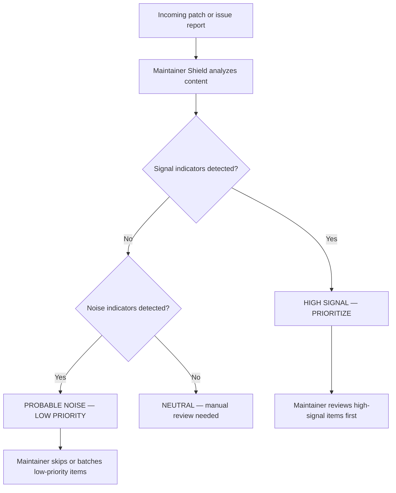

Dries Buytaert, the founder of Drupal, recently addressed a growing problem: AI-generated contributions are flooding open-source projects with low-value reports and patches that lack expertise. The human bottleneck — the reviewer — becomes the point of failure for the entire ecosystem.

<!-- truncate -->

I built **Drupal Maintainer Shield** to help. It is a CLI tool that scores incoming patches and issue descriptions as signal vs. noise, so maintainers can prioritize what matters and skip what does not.

:::danger[Maintainer Fatigue Is a Security Risk]
The curl project ended its bug bounty program because AI-generated reports were mostly noise. When maintainers burn out triaging garbage, real vulnerabilities get missed. Signal-vs-noise filtering is not convenience — it is security infrastructure.
:::

## The Problem

> "We need AI tools that help maintainers, not just contributors."
>
> — Dries Buytaert (paraphrased), [AI and Open Source Security](https://socket.dev/blog/dries-buytaert-ai-open-source-security)

If every AI agent can spin up a patch in seconds, the human reviewer becomes the bottleneck. Maintainer fatigue is not an abstract concern — it directly causes missed vulnerabilities and delayed patches.



## How It Works

The tool analyzes two categories of signals.

### Quality Signals (High Priority)

| Signal | What It Indicates |
|---|---|
| Structured security metadata (`Security-Category`) | Author follows Drupal security reporting conventions |
| Specific CVE references | Concrete vulnerability with tracking ID |
| SQL injection fix patterns (e.g., fixing `db_query` concatenation) | Actionable code-level remediation |
| Targeted patch with clear scope | Author understands the codebase |

### Noise Signals (Low Priority)

| Signal | What It Indicates |
|---|---|
| Generic AI boilerplate ("As an AI language model...") | Bot-generated with no human review |
| Vague descriptions without code references | Typical scanner export, not a real analysis |
| Overly broad "fix everything" patches | No understanding of module architecture |
| Missing reproduction steps | Cannot be verified or triaged |

:::tip[Run the Shield]
`bin/shield analyze patch.txt` — scores a patch file or issue description and outputs a prioritization recommendation with confidence score.
:::

## Example Analysis

```bash title="Terminal — analyze a high-quality patch"
bin/shield analyze patch.txt
```

```text title="High-signal output"
Recommendation:  HIGH SIGNAL - PRIORITIZE
Confidence Score: 100/100
Findings:        References specific CVE ID, Potential SQL injection fix detected.
```

```text title="Noise output"
Recommendation:  PROBABLE NOISE - LOW PRIORITY
Warning:         This contribution matches common AI noise patterns. Proceed with caution.
```

## Triage Checklist for Maintainers

- [ ] Set up Maintainer Shield in your triage workflow
- [ ] Run incoming patches through `bin/shield analyze` before manual review
- [ ] Prioritize high-signal items for immediate attention
- [ ] Batch low-priority items for weekly review or rejection
- [ ] Track false positive/negative rates to tune signal detection
- [x] Feed results back into project contribution guidelines

<details>
<summary>The curl project cautionary tale</summary>

The curl project had to end its bug bounty program because AI-generated security reports were mostly noise. Daniel Stenberg documented the problem: automated tools were filing reports that looked superficially credible but contained no real analysis. Each report still required human time to evaluate and dismiss.

This is "maintainer fatigue" at scale. If the triage cost of a bug bounty exceeds the security value of the reports, the program becomes a net negative.

Drupal Maintainer Shield takes the opposite approach: instead of filtering at the bounty program level, it filters at the individual report level. Maintainers keep receiving all contributions but get an automated first-pass assessment of quality.

</details>

## Why this matters for Drupal and WordPress

Drupal module maintainers on Drupal.org are already seeing AI-generated issue reports and patches that consume review time without delivering value. This tool gives them an automated first-pass filter before investing human attention. WordPress plugin maintainers on the WordPress.org repository face the same problem -- AI-generated support tickets and pull requests that look plausible but lack real analysis. The signal-vs-noise scoring pattern applies directly: scan for structured metadata, specific references, and actionable scope. Both ecosystems need maintainer-side tooling, not just contributor-side AI.

## What I Learned

AI-generated contributions are not going away. The volume will increase. The only sustainable response is tooling that helps maintainers separate signal from noise before they invest review time.

Drupal Maintainer Shield is a prototype, not a finished product. But the principle is sound: score contributions before human review, not after.

**View Code:** [drupal-ai-maintainer-shield on GitHub](https://github.com/victorstack-ai/drupal-ai-maintainer-shield)

## References

- [Dries Buytaert — AI and Open Source Security](https://socket.dev/blog/dries-buytaert-ai-open-source-security)
- [MITRE CWE List](https://cwe.mitre.org/)
- [Drupal Security Advisories](https://www.drupal.org/security)
