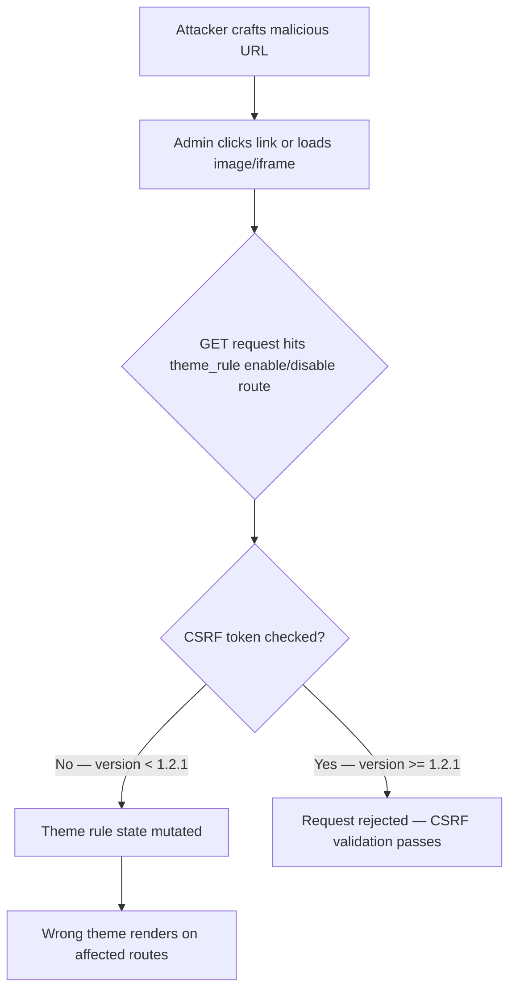

On February 25, 2026, Drupal published SA-CONTRIB-2026-012 for Theme Negotiation by Rules (`drupal/theme_rule`), tracked as CVE-2026-3211. The vulnerability: enable/disable actions for theme rules fire through GET requests. No CSRF token required.

<!-- truncate -->

:::danger[CSRF via GET — State Mutation Without Protection]
CVE-2026-3211 allows an attacker to trick an administrator into toggling theme rules by visiting a crafted link. If you run `drupal/theme_rule` below 1.2.1, your theme configuration can be manipulated through social engineering. Update now.
:::

## Severity Snapshot

| SA ID | CVE | Severity | Risk Score | Affected Versions | Patched Version | Action |
|---|---|---|---|---|---|---|
| SA-CONTRIB-2026-012 | CVE-2026-3211 | Moderately Critical | 13/25 | `< 1.2.1` | `1.2.1` | Update immediately |

## What Happened

The advisory covers a CSRF issue where enable/disable actions for theme rules were triggered through GET requests — no POST, no CSRF token validation. An attacker can trick an administrator into visiting a crafted link that toggles theme rules.

Primary impact: integrity. Theme-rule state drives which theme renders specific routes or request patterns. Unexpected rule toggling means users can receive the wrong presentation layer and operational behavior drifts from approved config.



> "An attacker can trick an administrator into toggling theme rules by visiting a crafted link. Integrity is affected because rule state can be changed."
>
> — Drupal Security Team, [SA-CONTRIB-2026-012](https://www.drupal.org/sa-contrib-2026-012)

## Why This Matters

This is not data exfiltration. But it is a real admin-action integrity problem. Theme rules control which theme renders specific routes. If those rules are unexpectedly enabled or disabled:

- Users receive the wrong presentation layer
- Operational behavior drifts from approved configuration
- In multi-tenant or branded contexts, this can cause visible business impact

:::tip[Quick Verification]
Run `composer show drupal/theme_rule` — if it reports anything below `1.2.1`, patch now.
:::

## Hardening Steps

```bash title="Terminal — update Theme Rule"
composer require drupal/theme_rule:^1.2.1
drush updb -y
drush cr
```

### Beyond the Patch — CSRF-Safe Admin Patterns

| Pattern | Requirement |
|---|---|
| State-changing operations | Must use POST, never GET |
| All mutating actions | Must validate CSRF tokens |
| Admin operations | Must have explicit access checks |
| Custom modules | Must follow the same rules |

## Triage Checklist

- [ ] Verify `drupal/theme_rule` is at `1.2.1` or newer: `composer show drupal/theme_rule`
- [ ] Check that no custom routes mutate config/entity state via GET
- [ ] Confirm admin actions that mutate state require POST + CSRF token
- [ ] Review recent logs for unexplained theme-rule toggles
- [ ] Limit permissions to administer theme-rule entities
- [x] Add regression tests for CSRF protection in custom modules

<details>
<summary>Regression test patterns for CSRF protection</summary>

Add these functional tests to your own modules to prevent similar issues:

1. **GET request must not mutate rule state.** Send a GET to any state-changing route and assert no mutation occurred.
2. **POST without token must be denied.** Send a POST without a CSRF token and assert a 403 response.
3. **POST with valid token performs expected change.** Send a POST with a valid CSRF token and assert the state changed correctly.

These three tests catch the exact class of bug that SA-CONTRIB-2026-012 describes. Add them to every module that has admin-facing state-changing routes.

</details>

### Process Controls

- [ ] Subscribe to Drupal security advisories and triage within 24 hours
- [ ] Require security-check steps in deployment checklists for contrib updates
- [x] Gate release tags on checklist completion in issue template or CI workflow

## Why this matters for Drupal and WordPress

This CSRF pattern -- state-changing operations exposed through GET requests -- is not unique to Drupal. Drupal site builders should audit every contributed module that has admin-facing toggle or enable/disable routes. WordPress plugin developers face the same risk: any admin-ajax action or custom REST endpoint that mutates state without a nonce check is vulnerable to the exact same attack vector. The hardening checklist (POST-only for mutations, CSRF token validation, explicit access checks) applies identically to WordPress plugins. If you maintain a WordPress plugin with admin settings that toggle on GET, patch it the same way Theme Rule was patched.

## Bottom Line

CSRF bugs through GET requests are a well-understood vulnerability class. The fix is straightforward: require POST + CSRF token for every state-changing operation. If your custom modules have similar patterns, audit them now — do not wait for an advisory.

## References

- [SA-CONTRIB-2026-012](https://www.drupal.org/sa-contrib-2026-012)
- [OSV: DRUPAL-CONTRIB-2026-012](https://api.osv.dev/v1/vulns/DRUPAL-CONTRIB-2026-012)


***
*Looking for an Architect who doesn't just write code, but builds the AI systems that multiply your team's output? View my enterprise CMS case studies at [victorjimenezdev.github.io](https://victorjimenezdev.github.io) or connect with me on LinkedIn.*
