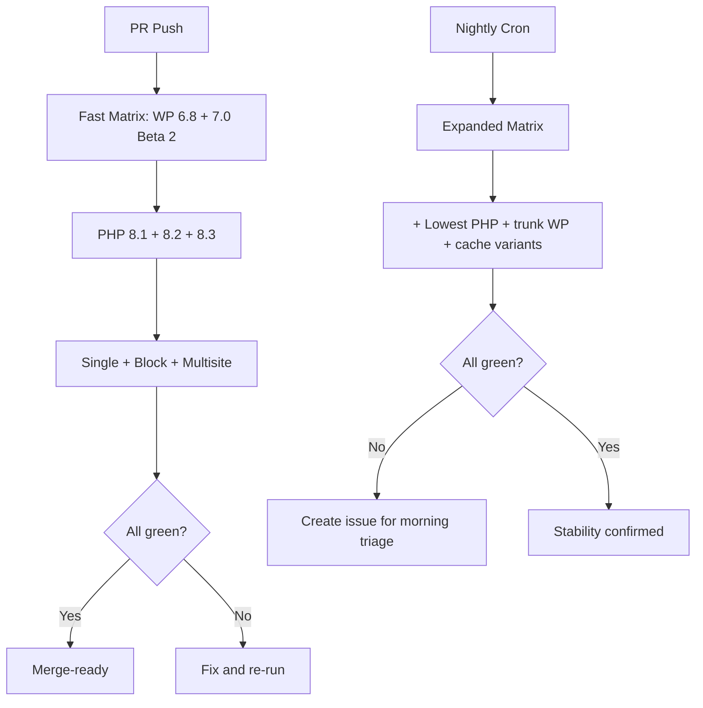
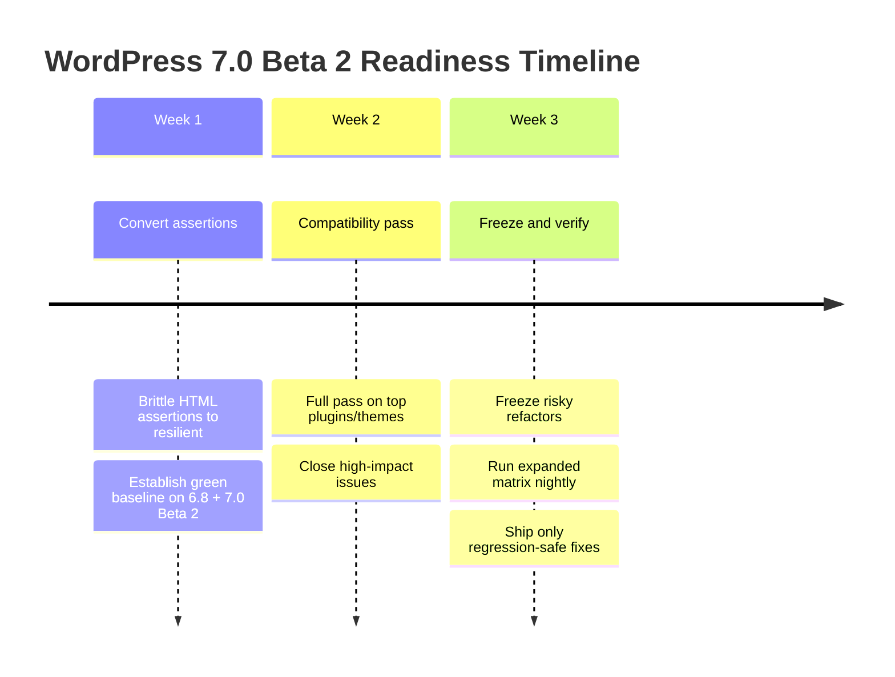

import Tabs from '@theme/Tabs';
import TabItem from '@theme/TabItem';

WordPress 7.0 Beta 2 (released on February 26, 2026) is the right point to shift from broad compatibility checks to targeted release hardening before the planned April 9, 2026 final release. I built this readiness plan focused on three areas: plugin/theme compatibility, PHPUnit HTML assertion updates, and a regression matrix that catches high-risk breakage quickly.

<!-- truncate -->

## 1) Plugin and theme compatibility plan

Use a two-lane strategy:

- **Lane A: Runtime compatibility** for real-world behavior in admin and frontend.
- **Lane B: Development compatibility** for build, lint, and test pipelines.

:::info[Two Lanes, One Goal]
Separating runtime and dev compatibility prevents false confidence. A plugin can pass all unit tests and still break in the editor.
:::

### Priority checks

| Area | What to test | Risk level |
|---|---|---|
| Editor integrations | Block registration, rendering, patterns, `theme.json` | High |
| Hook coverage | Filters/actions for content, queries, assets, REST | Medium |
| Script/style loading | Dependency handles, enqueue order, block assets | Medium-High |
| Database and options | Install/upgrade routines, settings migrations, defaults | Medium |
| Multisite and locale | Network activation, translations, RTL, charset | Low-Medium |

### Success criteria

- [ ] Zero fatal errors or warnings under `WP_DEBUG` and `SCRIPT_DEBUG`
- [ ] No capability leaks or permission regressions on admin routes and REST endpoints
- [ ] No block validation errors for existing stored content

## 2) PHPUnit HTML assertion updates

Where tests assert full HTML strings, migrate to resilient assertions that tolerate harmless markup variation.

<Tabs>
  <TabItem value="brittle" label="Brittle (Before)" default>

```php title="tests/RenderTest.php"
// Strict equality -- breaks on any markup change
// highlight-next-line
$this->assertEquals($expectedHtml, $renderer->render($input));
```

  </TabItem>
  <TabItem value="resilient" label="Resilient (After)">

```php title="tests/RenderTest.php" showLineNumbers
$html = $renderer->render( $input );
// highlight-start
$this->assertStringContainsString( 'wp-block-my-plugin', $html );
$this->assertStringContainsString( 'data-variant="compact"', $html );
$this->assertStringNotContainsString( '<script', $html );
// highlight-end
```

  </TabItem>
</Tabs>

The diff:

```diff
- $this->assertEquals($expectedHtml, $renderer->render($input));
+ $html = $renderer->render($input);
+ $this->assertStringContainsString('wp-block-my-plugin', $html);
+ $this->assertStringContainsString('data-variant="compact"', $html);
+ $this->assertStringNotContainsString('<script', $html);
```

:::tip[Keep One Strict Test]
Keep one strict snapshot-style test per critical renderer to catch structural regressions. But avoid making every test snapshot-like.
:::

### Assertion migration pattern

| Old Assertion | New Assertion | Why |
|---|---|---|
| `assertEquals($fullHtml, $output)` | `assertStringContainsString($key, $output)` | Tolerates harmless markup changes |
| Check exact attribute order | Check attribute presence | Order is unstable in some serializers |
| Assert full document structure | Assert semantic markers (role/class/data-attr) | Focus on contract, not formatting |

> If your suite uses the WordPress core test scaffold, prefer `assertEqualHTML()` for the few strict structure tests you keep.

## 3) Regression test matrix

### Fast PR matrix

| Dimension | Values |
|---|---|
| WordPress versions | 6.8 (latest stable), 7.0 Beta 2 |
| PHP versions | 8.1, 8.2, 8.3 |
| Site modes | Single site + classic theme; single site + block theme; multisite smoke |
| Database coverage | MariaDB and MySQL |
| Cache coverage | Object cache off (required) and on (if relevant) |

### Nightly expansion

- Add lowest supported PHP version
- Add latest trunk or nightly WordPress build
- Add object cache on/off variant if plugin behavior depends on transients/query caching



### Minimum regression suites

- [ ] Install/activate/deactivate/uninstall flows
- [ ] Admin settings save and nonce/cap checks
- [ ] Frontend rendering and shortcode/block output
- [ ] REST endpoints and auth rules
- [ ] Upgrade path from prior plugin/theme version with retained data

## Rollout sequence



<details>
<summary>WordPress 7.0 release calendar</summary>

| Date | Milestone |
|---|---|
| February 20, 2026 | Beta 1 |
| February 26, 2026 | Beta 2 |
| March 2026 | RC 1 (expected) |
| April 9, 2026 | Final release |

</details>

This plan keeps scope tight while still surfacing the failures most likely to affect production sites at WordPress 7.0 launch.
