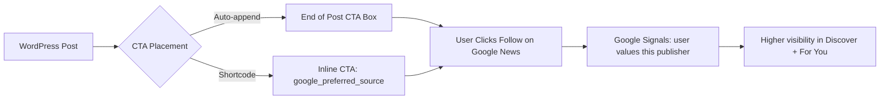

import Tabs from '@theme/Tabs';
import TabItem from '@theme/TabItem';

I built a lightweight WordPress plugin that encourages users to follow a site on Google News and set it as a preferred source. When a user follows your publication, they are more likely to see your content in Discover and "For You" feeds. This plugin makes adding that CTA a one-step operation.

<!-- truncate -->

## Why Google Preferred Sources Matter

When a user "follows" your publication on Google News, they are more likely to see your content in their "For You" feed and Discover. Setting a site as a "Preferred Source" (or just Following) is a strong signal to Google's algorithms that your content is valued by that specific user.

Most publishers know this matters but do not have a clean way to prompt users. This plugin adds a high-conversion CTA that auto-appends to posts or drops in via shortcode.



## Tech Stack

| Component | Technology | Why |
|---|---|---|
| Platform | WordPress | Target CMS for publishers |
| Coding standards | PHPCS (WordPress standard) | Verified compliance |
| Testing | PHPUnit + Brain Monkey | No WordPress database needed for tests |
| CTA style | Google-branded, modern UI | Fits naturally into themes |
| License | MIT | Open for adoption |

## Features

- **Admin Settings**: Easily configure your Google News Publication URL.
- **Auto-append CTA**: Automatically add a high-conversion call-to-action at the bottom of every post.
- **Shortcode Support**: Use `[google_preferred_source]` to place the CTA anywhere in your layouts.
- **Modern UI**: A clean, Google-branded CTA box that fits naturally into modern WordPress themes.

:::tip[Use the Shortcode for Landing Pages]
The auto-append works great for blog posts, but for landing pages or custom layouts, the `[google_preferred_source]` shortcode gives you precise placement control without touching templates.
:::

:::caution[Verify Your Google News Publication URL First]
If the configured URL is empty or set to `#`, the CTA renders nothing. Test with a real Google News publication URL before going live, otherwise your readers see... nothing.
:::

<Tabs>
<TabItem value="shortcode" label="Shortcode Rendering" default>

```php title="src/GooglePreferredSource.php" showLineNumbers
public function render_shortcode() {
$options = get_option( $this->option_name );
$url     = isset( $options['google_news_url'] ) ? $options['google_news_url'] : '#';

if ( empty( $url ) || '#' === $url ) {
// highlight-next-line
return ''; // No URL configured — render nothing
}

// Render the CTA box...
}
```

</TabItem>
<TabItem value="usage" label="Usage">

```php title="template-example.php"
// Auto-append: enabled by default in plugin settings

// Shortcode: place anywhere in your content
[google_preferred_source]

// Or in a template:
echo do_shortcode('[google_preferred_source]');
```

</TabItem>
</Tabs>

## Why this matters for Drupal and WordPress

Google's preferred source signals apply to any publisher, regardless of CMS. This WordPress plugin demonstrates the pattern -- auto-append or shortcode CTA -- that Drupal publishers can replicate as a custom block or Twig template snippet. Drupal sites using the Google News sitemap module already have the publication URL; adding a follow CTA is the missing conversion step. For WordPress publishers, this plugin is drop-in ready. For Drupal publishers, the same CTA markup and Google News URL structure work identically -- the only difference is the delivery mechanism (block plugin vs. WordPress shortcode).

## Next Steps

Future iterations could include:
- Analytics tracking for CTA clicks.
- Gutenberg block for more visual placement control.
- Integration with Google Search Console API to verify publication status.

<details>
<summary>Plugin file structure</summary>

```text showLineNumbers
wp-google-preferred-source-demo/
  wp-google-preferred-source.php
  src/
    GooglePreferredSource.php
    Admin/
      Settings.php
  assets/
    css/
      cta-styles.css
  tests/
    GooglePreferredSourceTest.php
```

</details>

## References

- [View Code](https://github.com/victorstack-ai/wp-google-preferred-source-demo)


***
*Need an Enterprise CMS Architect to modernize your legacy PHP platforms? View my case studies at [victorjimenezdev.github.io](https://victorjimenezdev.github.io) or connect with me on LinkedIn.*
